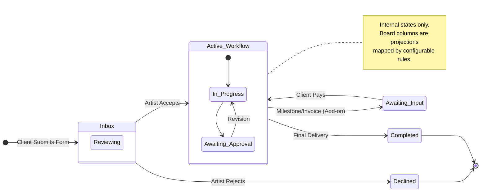
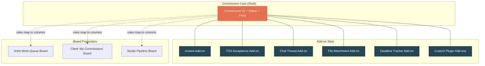
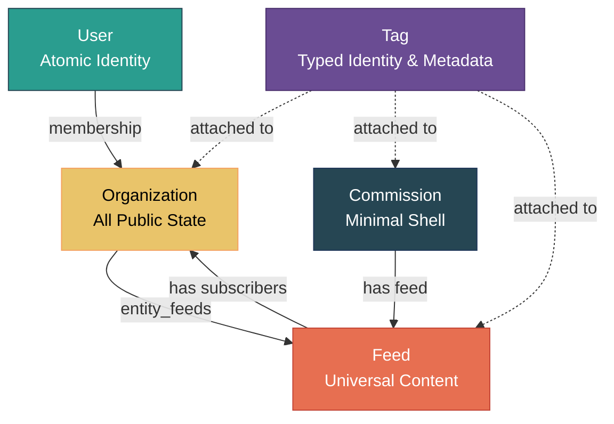
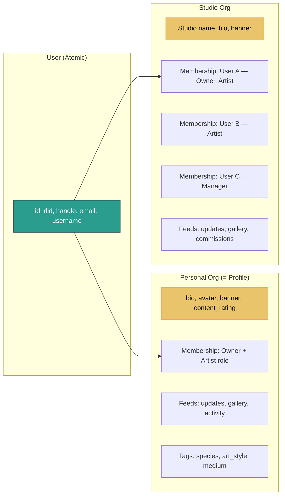
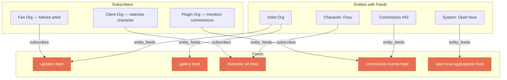
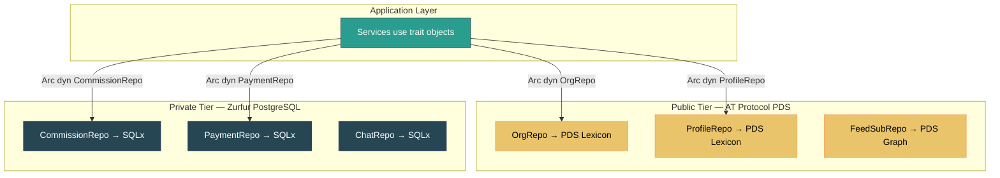
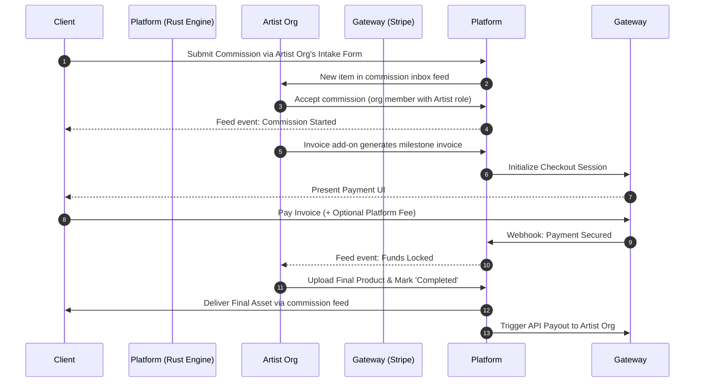
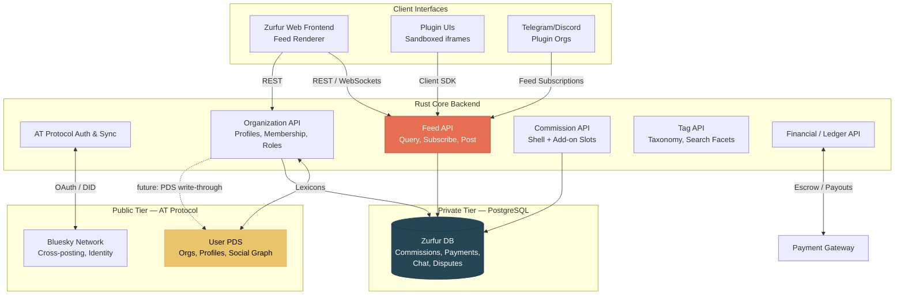
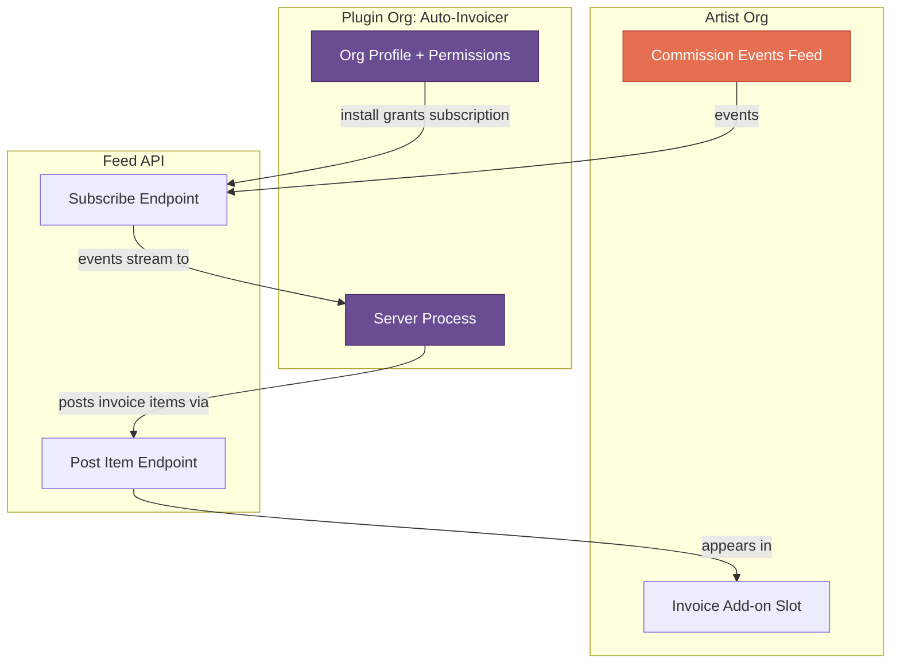
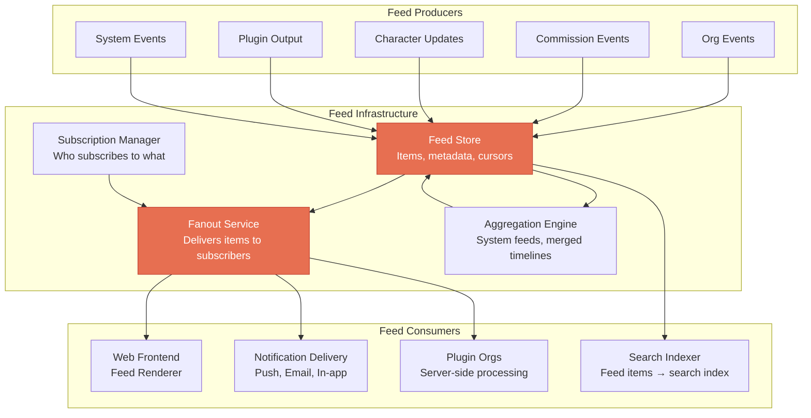

# Zurfur - Comprehensive Design Document

## Revision History

| Version | Date | Summary |
|---------|------|---------|
| v1 | 2026-03 | Initial design document. Flat account hierarchy, artist-as-toggle, plugin marketplace, headless commission engine. |
| v2 | 2026-04 | Org-centric identity, feed-centric content model, two-tier data architecture, plugin-as-org, tags-over-columns, five root aggregates. Informed by Feature 2 implementation. |

---

## Table of Contents

- [Part 1: High-Level Overview](#part-1-high-level-overview)
- [Part 2: Feature Breakdown & Core Mechanics](#part-2-feature-breakdown--core-mechanics)
- [Part 2.5: Core Domain Architecture](#part-25-core-domain-architecture)
- [Part 3: User Journey & Workflow](#part-3-user-journey--workflow)
- [Part 4: UI/UX & Art Direction](#part-4-uiux--art-direction)
- [Part 5: Technical Architecture & Systems](#part-5-technical-architecture--systems)
- [Part 6: Monetization & Roadmap](#part-6-monetization--roadmap)

---

## Part 1: High-Level Overview

### 1.1 Project Title

**Zurfur** ([Zurfur.app](https://zurfur.app))

### 1.2 Elevator Pitch

Zurfur is a decentralized art commission platform specifically tailored for the furry community. Built on the AT Protocol, it acts as a secure, feature-rich bridge between artists and clients while ensuring true data sovereignty. Unlike traditional walled-garden platforms, Zurfur guarantees that users own their galleries (the gallery feed serves as the portfolio), commission histories, and reputations.

### 1.3 Core Concept

The primary goal of Zurfur is to facilitate the art commission process without locking users into a centralized ecosystem. It provides the tools necessary to manage complex commissions (like handling reference sheets and specific workflow statuses) while acting purely as a service provider rather than a data jailer.

### 1.4 Target Audience

- **Furry Artists & Makers:** Creators looking for a streamlined, organized way to manage incoming commission requests, track progress, and build a portable reputation. This includes digital artists, traditional artists, and physical crafters (e.g., fursuit makers, sculptors, badge makers).
- **Furry Art Clients/Commissioners:** Users looking to easily commission works, provide character references, track the status of their paid work, and maintain a history of their commissioned pieces.

### 1.5 Design Philosophy & Pillars

- **Convenience Through Consolidation (The "Super App" Model):** Zurfur does not aim to reinvent the wheel or introduce unnecessarily groundbreaking new paradigms. Instead, its core value lies in taking proven, existing tools (Kanban boards, invoicing, chat, custom profiles) and centralizing them into one seamless, convenient platform. It acts as a modular "Super App" specifically built for the creator economy.
- **Plugin-Encouraged Design:** Zurfur is designed to function similarly to a giant, collaborative open-source project. The community is actively encouraged to build, share, and monetize custom tools, views, and integrations. **(v2)** Plugins are first-class participants in the platform — they authenticate as organizations, subscribe to feeds, and interact through the same APIs as users.
- **Data-Driven Strategy:** By surfacing transparent, month-to-month statistics, Zurfur empowers both artists and clients to make safe, strategic decisions based on historical data rather than guesswork.
- **Data Sovereignty First:** Users retain absolute control over their information. The platform serves the user, not the other way around. **(v2)** Public identity and social data live on the user's AT Protocol PDS; private transaction data stays in Zurfur's database. Users can leave and take their identity with them.
- **Protocol-Based Architecture:** By leveraging the AT Protocol (the technology powering Bluesky), Zurfur prioritizes interoperability, portability, and resilience.
- **(v2) Feed-Centric Content Model:** All content flows through feeds. Galleries, activity streams, and notifications are all feed views. The frontend is fundamentally a feed renderer with specialized filters. This unifies content delivery and simplifies the plugin model.
- **(v2) Organization-Centric Identity:** Every capability — roles, titles, bios, permissions, public profiles — is expressed through organization membership. The user entity is atomic identity only. This eliminates special-casing between solo creators and studios.

---

## Part 2: Feature Breakdown & Core Mechanics

This section details the granular feature modules that make up the Zurfur platform.

### Feature 1: AT Protocol Auth & Bluesky Integration

- **1.1 Frictionless Onboarding (Bluesky OAuth):** Users bypass traditional registration. Login is handled entirely via Bluesky OAuth, utilizing the user's Decentralized Identifier (DID) to securely port their existing identity to the platform. **(v2)** On first login, the system creates a User (atomic identity) and a personal Organization (the user's public profile) in a single flow.
- **1.2 Bi-Directional Data Sync:** Information is seamlessly shared between Zurfur and Bluesky. Artists can automatically cross-post commission openings, completed artwork, or status updates directly to their Bluesky feed from the Zurfur dashboard. **(v2)** Sync targets are org-level feeds, not user-level actions — an org's "updates" feed can be configured to cross-post to the owner's Bluesky.
- **1.3 Social Graph Import:** The platform reads the user's existing AT Protocol social graph, instantly recognizing established "Follows" and "Mutuals" without requiring users to rebuild their network from scratch. **(v2)** Imported follows are mapped to feed subscriptions on the corresponding personal org's default feed.
- **1.4 Native Social Integration:** Bluesky feeds and Direct Messages (DMs) are integrated natively into the Zurfur UI, allowing it to function as a full social media client while focusing its custom tools on the art economy.

### Feature 2: Identity & Profile Engine (v2 — Organization-Centric)

- **2.1 Atomic User Identity (v2):** The User entity holds only identity data: `id`, `did`, `handle`, `email`, `username`. No feature flags, roles, bios, or artist toggles. All capabilities are expressed through organization membership. This replaces the v1 "flat account hierarchy" where "Artist" was a toggle on the user.
- **2.2 Personal Organization as Profile (v2):** Every user receives a personal organization on signup. The personal org IS the user's public profile — it holds the bio, avatar, banner, content rating, commission availability, and focus tags. There is no separate "user profile" concept.
- **2.3 Organization Membership & Roles (v2):** Users can own and belong to many organizations. Roles are administrative positions (Owner, Admin, Mod, Member) — a constrained enum, not free-text. Titles ("Lead Character Designer", "Furry Artist") are cosmetic and self-given. Permissions are per-membership via bitfield. Ownership is derived from `role == Owner`. Personal org owners are immutable. Solo creators and multi-member studios use the exact same org model with no special casing.
- **2.4 Profile Customization (The Toyhouse Model):** Users have deep control over their org profile and character pages (colors, CSS, layout). Customization is stored at the org level, since the org is the profile.
- **2.5 The "Universal Layout" Safety Fallback:** A mandatory, highly visible toggle that instantly strips all custom user code from a profile, reverting it to the platform's clean, safe, and accessible default theme.
- **2.6 SFW/NSFW Viewer Control:** A strict, viewer-controlled toggle (defaulting to SFW) that filters character galleries and active commissions. Content rating is a tag on feeds and feed items.
- **2.7 Character Repositories:** Dedicated entities for original characters, storing reference sheets, hex codes, species info, and linked galleries. **(v2)** Each character has its own feed. "Character gallery" is a feed view filtered by that character's feed. Ref sheets, art, and updates all flow through the character's feed.

### Feature 3: The Headless Commission Engine (The "Card") (v2 — Shell + Add-ons)

- **3.1 Commission as Minimal Shell (v2):** The commission entity is minimal: `id`, `current_state (artist-defined via pipeline template)`, and a feed. Everything else — invoices, TOS acceptance, chat threads, file attachments, milestone tracking — attaches via add-on slots rather than being baked into the commission schema. This replaces the v1 monolithic card model.
- **3.2 Artist-Defined States (v2):** Commissions have artist-defined states (e.g., 'sketching', 'coloring', 'review', 'delivered') configured per pipeline template. The system only distinguishes active vs terminal states. These are not displayed directly — visual presentation is handled by boards.
- **3.3 Boards as Projections (v2):** Kanban boards and pipeline views are separate entities that map commissions to columns via configurable rules. The same commission can appear on multiple boards with different column placements. An artist's "Work Queue" board and a client's "My Commissions" board are both projections over the same underlying commission data.
- **3.4 Event-Driven History:** Every action (comment, payment, file upload, state change) is an "Event" appended to the commission's feed, serving as an immutable history log and single source of truth for dispute resolution.
- **3.5 Add-on Slots (v2):** Commission cards are shells with add-on slots. Server-side add-ons are feed participants that react to commission events and post items back. Client-side add-ons render in sandboxed iframes within the card UI. This is the mechanism for invoicing, TOS, chat, and file management — they are all add-ons, not core card features.
- **3.6 Deadline & Time Tracking:** Automated triggers that flag cards as "Late" or measure turnaround analytics based on start and end timestamps. Implemented as a system add-on.
- **3.7 Multi-Party Collaboration:** Cards support many-to-many relationships via org memberships, allowing multiple artists (org members) to collaborate on a piece, or multiple users to co-commission a group piece, with shared visibility for all involved.

> **Note:** This diagram illustrates a conceptual workflow as one artist might configure it. Commission states are **artist-defined per pipeline template**, not system constants. The system only tracks whether a commission is active or terminal. See [Feature 3](features/03-commission-engine/README.md) for the canonical model.

### Feature 4: Financial & Payment Gateway

- **4.1 Platform Intermediary (Escrow-Lite):** Zurfur acts as the merchant of record. Clients pay the platform; the platform holds/tracks the funds and automatically issues payouts to the artist upon completion/milestones, minimizing chargeback fraud.
- **4.2 Flexible Invoicing:** Support for multiple invoices per Card. **(v2)** Invoicing is implemented as a commission add-on, not a core card field. The invoice add-on subscribes to the commission's feed and posts payment events.
- **4.3 Installments & Subscriptions:** Support for timed/automated billing cycles (e.g., partial payments once a month).
- **4.4 Voluntary Fee Coverage:** A checkout toggle allowing buyers to voluntarily absorb platform transaction fees so the artist retains 100% of their quote.

### Feature 5: Omnichannel Communications

- **5.1 Isolated Card Chat (v2):** A private messaging thread bound to a Commission Card. **(v2)** Chat is a commission add-on, not a core card feature. The chat add-on manages its own feed of messages attached to the commission. This is distinct from the formal, immutable event history.
- **5.2 Omnichannel Sync (API Abstraction):** The chat logic is abstracted, allowing bots to "subscribe" to a card's feed. **(v2)** Since plugins are orgs and orgs interact via feeds, external bridges (Telegram, Discord, Matrix) are plugin orgs that subscribe to commission chat feeds and relay messages bidirectionally.

### Feature 6: The Plugin Ecosystem (v2 — Plugins are Orgs)

- **6.1 Plugins as Organizations (v2):** Plugins authenticate as organizations, subscribe to feeds, react to events, and post feed items. "Installing a plugin" means granting a plugin org feed subscription and/or write access to specific feeds. There is no separate plugin API — the feed API IS the plugin API. This replaces the v1 model of isolated modules interacting via safe webhooks.
- **6.2 Server-Side Plugins (v2):** Feed participants that subscribe to events, process data, and post results back to feeds. Examples: auto-invoicing on milestone completion, price estimation based on commission history, queue analytics.
- **6.3 Client-Side Plugins (v2):** Sandboxed iframes that render within the Zurfur UI (inside commission card add-on slots, on profile pages, as dashboard widgets). They consume feed data via a safe client SDK.
- **6.4 Native Statistical AI Plugins:** Premium analytical tools (non-generative). Features include market price suggestions, queue completion forecasting, and profile engagement tracking. **(v2)** These are server-side plugin orgs that subscribe to relevant feeds.
- **6.5 Plugin Marketplace:** A marketplace where the community can upload, share, and monetize plugins. **(v2)** Since plugins are orgs, the marketplace is a curated directory of plugin orgs with install flows that manage feed permissions.

### Feature 7: Community & Analytics

- **7.1 Commission Subscriptions (v2):** Push notifications triggered when a specific artist opens their commission queue. **(v2)** This is implemented as a feed subscription — "subscribe to artist commission availability" means subscribing to that org's "availability" feed.
- **7.2 Gamification:** XP, Badges, and Community Rewards for successful transactions and positive platform interactions.
- **7.3 The Strategy Engine (Open Metrics):** Open, reproducible month-to-month statistics. Clients can see artist turnaround trends/price drops; Artists receive "Risk Assessment" warnings for clients with a history of disputes or late payments.

### Feature 8: Search & Discovery

- **8.1 Artist Search (v2):** Users can find artists by tag, art style, species specialty, price range, and availability status. Supports full-text and faceted filtering. **(v2)** Search indexes org profiles (since the org is the profile) and their associated tags.
- **8.2 Tag Taxonomy (v2):** A structured, community-curated tag system covering species, art style, medium, and content rating. **(v2)** Tags are a root domain aggregate. Descriptive attributes (species, colors, art style, body type, etc.) are tags, not database columns. Only bio/description is free text. Tags are reusable across all entities — orgs, characters, commissions, feed items.
- **8.3 Recommendation Engine:** Personalized suggestions based on commission history, followed artists, and character species. Surfaces relevant artists a user may not have discovered organically.
- **8.4 "Open Now" Feed (v2):** A real-time, filterable feed of artists currently accepting commissions, sorted by recency and optionally by relevance to the user's preferences. **(v2)** This is literally a feed — a system-level aggregation feed that collects availability-change events from all org feeds.

### Feature 9: Notification System

- **9.1 In-App Notification Center (v2):** A unified notification feed (bell icon, unread count) categorized by type: commission updates, payments, social interactions, and system alerts. **(v2)** The notification center is a personal feed view — notifications are feed items delivered to the user's notification feed.
- **9.2 Push Notifications:** Browser and mobile push for critical events (payment received, commission state change, new message in card chat).
- **9.3 Email Digests:** Configurable email summaries (daily/weekly) aggregating commission activity, new followers, and marketplace updates.
- **9.4 Webhook Notifications (v2):** A developer-facing API allowing plugins and external integrations to subscribe to specific event types programmatically. **(v2)** Since plugins are orgs with feed subscriptions, webhook delivery is a built-in capability of the feed system — no separate webhook API needed.

### Feature 10: Organization Terms of Service (TOS) Management

- **10.1 TOS Builder:** A structured editor for organizations to define their rules, boundaries, refund policy, usage rights, and communication expectations. **(v2)** TOS is managed at the org level (since the org is the artist profile).
- **10.2 TOS Versioning:** Immutable snapshots of each TOS revision. The specific version a client agreed to at the time of commission submission is preserved and linked to the Card's audit trail.
- **10.3 Mandatory Acknowledgment (v2):** Clients must explicitly accept the organization's current TOS before submitting a commission request. **(v2)** This acceptance is recorded as an event in the commission's feed via the TOS add-on.
- **10.4 TOS Diff View:** A visual comparison tool showing what changed between TOS versions, so returning clients can quickly review updates before re-commissioning.

### Feature 11: Content Moderation & Trust/Safety

- **11.1 User Reporting:** Any user can report profiles, commission cards, chat messages, or gallery content for policy violations (harassment, scams, undisclosed NSFW, IP theft).
- **11.2 Block & Mute (v2):** User-level controls to prevent interaction. Blocking prevents all contact and hides the blocked user's content; muting silently suppresses notifications without alerting the other party. **(v2)** Block/mute operates on org-to-org relationships and propagates through feed subscriptions.
- **11.3 DMCA/Takedown Flow:** A formal, documented process for copyright claims on uploaded content, including counter-notification support, aligned with legal requirements.
- **11.4 Content Flagging:** A combination of automated heuristics (e.g., untagged NSFW detection) and manual community flagging, feeding into the moderation queue (see Feature 13).

### Feature 12: Dispute Resolution

- **12.1 Dispute Filing:** Either party (artist or client) can open a formal dispute on an active commission card. Filing a dispute freezes any pending fund releases until resolution.
- **12.2 Evidence Submission (v2):** Both parties submit evidence referencing the Card's immutable event history (timestamps, state changes, chat logs, file deliveries). **(v2)** The commission's feed IS the audit trail — all events are feed items with timestamps and authorship.
- **12.3 Resolution Flow:** A structured mediation process: automated resolution for clear-cut cases (e.g., no delivery after deadline + paid invoice), escalation to platform review for complex disputes.
- **12.4 Refund & Payout Policies:** Clear rules for partial refunds based on milestone completion, time invested, and deliverables provided. Policies are transparent and referenced during dispute resolution.

### Feature 13: Platform Administration

- **13.1 User Management Dashboard:** Internal tooling to view, suspend, or ban accounts, audit user activity, and manage role escalations. **(v2)** Operates on both Users and Organizations, since all public-facing state lives on orgs.
- **13.2 Financial Auditing:** Transaction logs, payout tracking, fee reconciliation, and fraud detection dashboards for the operations team.
- **13.3 Moderation Queue:** A centralized queue for reviewing reported content, active disputes, flagged accounts, and DMCA claims. Supports priority sorting and assignment to moderators.
- **13.4 Plugin Org Moderation (v2):** Tools to review, disable, or delist plugin orgs. Revoke feed subscriptions and write permissions for abusive plugins.
- **13.5 AT Protocol Admin Operations (v2):** PDS takedown requests, record labeling, and AT Protocol network moderation tooling.
- **13.6 System Health & Metrics:** API performance monitoring, error rate tracking, active user counts, and infrastructure health dashboards.

---

## Part 2.5: Core Domain Architecture (v2)

This section describes the fundamental domain model that underpins all features. These decisions were crystallized during the Feature 2 implementation and inform everything that follows.

### 2.5.1 Five Root Domain Aggregates

The entire Zurfur domain is built on five root aggregates. Every feature decomposes into operations on these five entities:

| Aggregate | Responsibility | Key Relationships |
|-----------|---------------|-------------------|
| **User** | Atomic identity. `{id, did, handle, email, username}`. Nothing else. | Owns orgs via memberships. |
| **Organization** | All public-facing state. Profiles, bios, roles, permissions, commission availability. Personal orgs = user profiles. Team orgs = studios/groups. Plugin orgs = installed plugins. | Has members (users), has feeds, has tags. |
| **Feed** | Universal content container. Feed items contain feed elements (text, images, files, events, embeds). Galleries, activity streams, notifications, commission histories. | Attached to entities via `entity_feeds` (polymorphic). Has feed items. Has subscribers. |
| **Commission** | Minimal shell: `{id, pipeline_template_id, current_state}`. States are artist-defined per pipeline template, not a system enum. Add-ons attach via slots. | Has a feed. Participants are orgs. Add-ons are feed participants. |
| **Tag** | Typed, cross-cutting identity and metadata. Entity-backed tags (org/character) are auto-created and immutable; metadata/general tags are user-created descriptors. | Attached to any entity via `entity_tags`. Org and character tags double as attribution. |

### 2.5.2 User is Atomic

The User entity is intentionally minimal. It holds only what is needed to authenticate and link to the AT Protocol identity:

- `id` (UUID)
- `did` (AT Protocol Decentralized Identifier)
- `handle` (synced from Bluesky)
- `email` (optional)
- `username` (chosen on Zurfur)

No bios. No roles. No feature flags. No `is_artist`. Everything else lives on organizations. This is a hard architectural constraint that must be maintained as new features are added.

### 2.5.3 Organization-Centric Identity

Every user gets a **personal organization** on signup. This personal org IS the user's public profile:

- **Bio, avatar, banner** — stored on the personal org's profile
- **"Artist" status** — an org role, not a user flag. A user is an "artist" when their personal org (or any org they belong to) has the Artist role on their membership.
- **Commission availability** — expressed through tags on the org (e.g., `status:open`)
- **Focus tags** (species, art style, medium) — tags on the org
- **Content rating** — an org-level setting

There is no special casing between personal orgs and team orgs. A solo artist and a fursuit-making studio use the exact same data model. The only distinction is that personal orgs have a `is_personal = true` flag (one per user, enforced by partial unique index) and resolve `display_name` from the owner's handle when NULL.

### 2.5.4 Feeds as Universal Content Container

Feeds are a root domain concept and the primary content delivery mechanism. Any entity can have feeds via `entity_feeds` (polymorphic join):

- **Org feeds:** updates, gallery, activity, commissions
- **Character feeds:** art, ref sheets, updates
- **Commission feeds:** event history, chat (via add-on)
- **System feeds:** "Open Now" aggregation, trending, moderation queue

Feed taxonomy:

| Property | Description |
|----------|-------------|
| `feed_type` | `system` or `custom`. Determines deletion protection only — system feeds cannot be deleted. |
| `entity_feeds` | Polymorphic join: `(entity_type, entity_id, feed_id)`. Any entity can have multiple feeds. |
| Feed items | Container for feed elements. Timestamped, authored. Each item has one or more elements. |
| Feed elements | Individual content pieces within a feed item. Typed (text/image/file/event/embed). A single feed item can have multiple elements. |
| Subscribers | Orgs that subscribe to a feed. Subscription = follow/watch. |

**Key insight: the frontend is a feed renderer.** Gallery views, activity streams, notification centers, and commission histories are all the same component — a feed renderer with different filters and item templates.

### 2.5.5 Following = Feed Subscription

The social graph is unified under feed subscriptions. There are no separate follows, watches, or notification subscription tables:

| User Action | Implementation |
|-------------|---------------|
| Follow an artist | Subscribe to their personal org's "updates" feed |
| Watch a character | Subscribe to the character's feed |
| Get commission updates | Subscribe to the commission's events feed |
| Get "Open Now" alerts | Subscribe to the system "open-now" aggregation feed |
| Install a plugin | Grant the plugin org a subscription (with write access) to target feeds |

This means the social graph, content delivery, notification routing, and plugin permissions are all the same mechanism: feed subscriptions with varying permission levels.

### 2.5.6 Two-Tier Data Architecture

Data lives in two tiers, separated by privacy:

| Tier | Storage | Data | Examples |
|------|---------|------|----------|
| **Public** | AT Protocol PDS (user's own data server) | Identity, social graph, public profiles, org memberships, galleries | Org profiles, character ref sheets, gallery posts, follow relationships |
| **Private** | Zurfur PostgreSQL | Transactions, financial data, private communications, disputes | Commission internals, invoices, payments, chat messages, dispute evidence |

The repository trait abstraction in the domain layer enables this split cleanly:

**Migration path:** MVP uses PostgreSQL for everything (via `SqlxOrgRepo`, `SqlxProfileRepo`, etc.). When AT Protocol Lexicons are defined, public-tier repos get `PdsOrgRepo` implementations. The application and API layers never change — only the persistence wiring.

### 2.5.7 Tags Over Columns

Descriptive attributes are tags, not database columns:

- Species, art style, medium, content rating, body type, color palette, genre, kink tags — all are entries in the Tag aggregate.
- Tags are reusable across entities: the same "canine" tag can appear on an org profile, a character, a commission, and a feed item.
- Only `bio`/`description` fields are free text. Everything else that could be a filter or facet is a tag.
- Tag taxonomy is community-curated with platform-maintained canonical tags for common concepts.

This keeps the schema stable as new descriptive dimensions are added — no migrations needed for "we want to filter by fur pattern now."

Commission availability (open/closed/waitlist) is also a tag on the org — not a dedicated column.

### 2.5.8 Typed Tags & Entity-Backed Identity

Tags have a `tag_type` that determines their behavior:

| Tag Type | Entity-Backed | Auto-Created | Mutable Identity | Examples |
|----------|--------------|--------------|-----------------|----------|
| `organization` | Yes (org_id) | On org creation | No — tag is permanent, display resolves from org | Artist attribution, studio credit |
| `character` | Yes (character_id) | On character creation | No — tag is permanent, display resolves from character | Character depiction in art |
| `metadata` | No | User-created | Name is the identity | "canine", "digital art", "fullbody" |
| `general` | No | User-created | Name is the identity | Free-form descriptive tags |

**Entity-backed tags** (organization, character) are immutable references. The tag's UUID never changes and cannot be deleted, even if the entity's display name changes. This makes attribution a first-class operation: tagging a commission with an artist's org tag IS the attribution — no separate "participants" table needed.

**Attribution via tags:** When an artist creates a commission piece, their org's tag gets attached (type: `organization`). When a character is depicted, the character's tag gets attached (type: `character`). "Show me everything by this artist" and "show me all digital art" are the same query shape — just filtered by tag type.

**Schema implications:**
- `tags` table: `id`, `tag_type` (organization/character/metadata/general), `entity_id` (nullable — set for org/character tags), `name` (display name for metadata/general; entity-backed tags resolve from their entity)
- `entity_tags` junction: `entity_type`, `entity_id`, `tag_id` — universal assignment (same pattern as `entity_feeds`)
- Metadata tags can optionally have a `category` for faceted search (species, art_style, medium, etc.)

---

## Part 3: User Journey & Workflow

### 3.1 Frictionless Onboarding (AT Protocol & Bluesky OAuth)

Users skip standard registration. They log in via existing Bluesky credentials (OAuth). Their DID (Decentralized Identifier) and profile metadata port over instantly, establishing immediate trust. **(v2)** On first login:

1. A User entity is created (atomic identity: DID + handle).
2. A personal Organization is created automatically (the user's public profile).
3. The user is added as Owner of their personal org.
4. System feeds are created on the personal org (updates, gallery, activity).
5. The user lands on their org profile, ready to set bio, tags, and availability.

### 3.2 The Critical Route (MVP Core Sequence)

The absolute minimum viable path that must function end-to-end without failure to ensure platform viability.

**(v2)** Note that the Artist is represented by their org, not their user account. Commissions are between a client and an artist org. In a studio, any org member with appropriate permissions can act on the commission.

### 3.3 The Commissioner's Journey (Extended Client Flow)

1. **Discovery:** User browses org profiles and feeds, or uses tag-based search to find an open artist org.
2. **Review:** User checks the artist org's statistical data (average turnaround time), reads their TOS (managed at org level), and browses the org's gallery feed.
3. **Application:** User attaches a native Character (with its own feed of ref sheets) to a commission intake form submitted to the artist org.
4. **Tracking & Chat:** User monitors commission state changes via the commission's event feed. Communicates with the artist via the chat add-on. External bridges (Telegram/Discord plugin orgs) relay messages if configured.
5. **Completion:** Upon delivery, the artwork is posted to the commission's feed. The user optionally cross-posts to their personal org's gallery feed and to Bluesky via the sync feature.

### 3.4 The Artist's Journey (Extended Creator Flow)

1. **Opening Gates:** Artist updates their org's commission availability tag/setting. This posts an event to the org's "availability" feed, which propagates to subscribers and to the system "Open Now" aggregation feed.
2. **Risk Assessment:** Artist reviews incoming commissions in their org's inbox feed, checking the client's org reputation (dispute history, completion stats).
3. **Active Workflow:** Artist uses their org's board projection to drag commissions through visual stages. The board maps internal states to columns via configurable rules.
4. **Delivery & Gamification:** Final delivery posts to the commission feed, triggers fund release via the payment add-on, and awards both parties platform XP.

### 3.5 The Studio Journey (v2 — Multi-Member Org Flow)

1. **Studio Setup:** An artist creates a team organization, invites collaborators, and assigns roles (Lead Artist, Colorist, Manager).
2. **Shared Pipeline:** The studio org has its own commission inbox, boards, and feeds. Incoming commissions are visible to all members with appropriate permissions.
3. **Assignment:** A Manager assigns commissions to specific artists within the org. The commission's feed tracks who is working on what.
4. **Unified Billing:** Invoices are issued from the studio org. Payouts go to the org's connected payment account. Internal revenue splitting is handled outside the platform (or by a future add-on).
5. **Public Profile:** Clients see a single studio profile with a gallery feed, team roster, and shared TOS — the same model as a solo artist, just with more members.

---

## Part 4: UI/UX & Art Direction

### 4.1 Power-User & Keyboard-First Design

Efficiency is paramount. The interface is engineered to be entirely navigable without a mouse.

- **Global Command Palette:** `Cmd/Ctrl + K` to instantly jump to org profiles, active commissions, feeds, or trigger plugins.
- **Vim-Style Pipeline:** Navigate board projections using `h`, `j`, `k`, `l`. Move cards via `Shift + Arrow`.
- **Custom Keybinds:** Power users can map repetitive actions (e.g., "Generate Invoice") to custom shortcuts.

### 4.2 Visual Identity & Aesthetics

- **Core Color Palette:** A sleek, high-contrast base of Black and White, heavily accented with vibrant Gold and Skyblue/Blue. This provides a premium, recognizable backdrop that makes uploaded artwork stand out while maintaining a distinct platform identity.
- **Universal Layout Baseline:** The core platform UI is minimalist and information-dense, prioritizing readability of the board projections, feed views, and statistical graphs.

### 4.3 The Feed Renderer (v2)

**(v2)** The frontend is fundamentally a **feed renderer**. Every major view in the application is a feed rendered with a specific template and filter:

| View | Feed Source | Item Template | Filter |
|------|-------------|---------------|--------|
| Gallery (profile + character) | Org's/character's gallery feed | Image grid (renders feed elements) | content_rating, tags |
| Character page | Character's feed | Ref sheet + art grid | character_id |
| Commission history | Commission's event feed | Timeline | event_type |
| Notification center | User's notification feed | Alert list | unread, category |
| "Open Now" | System aggregation feed | Artist cards | availability, tags |
| Dashboard activity | Merged subscriptions | Activity stream | recency |

This means adding a new "view" to the platform requires:
1. Creating a feed (or reusing an existing one)
2. Defining an item template
3. Configuring filters

No new backend endpoints are needed for new views — they are all feed queries with parameters.

### 4.4 Mobile-First & Progressive Web App (PWA)

The frontend is developed with a **mobile-first** approach, ensuring the UI is designed for small screens first and scales up to desktop. The application is delivered as a **Progressive Web App (PWA)**, providing:

- **Installable Experience:** Users can add Zurfur to their home screen on any device without app store distribution — bypassing platform gatekeeping that often restricts NSFW-capable applications.
- **Push Notifications:** Service worker-powered push notifications for commission updates, payments, and messages (directly supporting Feature 9).
- **Offline Resilience:** Cached assets and read-only offline access to galleries, character sheets, and commission history via service worker strategies.
- **Responsive Layouts:** Touch-first interaction patterns (swipe to move cards, pull-to-refresh) that gracefully enhance to keyboard-first power-user controls on desktop.

> **Note:** The Rust backend is fully headless and API-first. It is entirely agnostic to the client consuming it. The PWA frontend is simply one client — third-party apps, plugin UIs (sandboxed iframes), and native mobile apps can all consume the same API.

---

## Part 5: Technical Architecture & Systems

### 5.1 Headless Core & API-First Design

Given the absolute necessity for extreme security, memory safety, and high concurrency (handling real-time chats, financial webhooks, and event streams), the core backend engine is built using Rust. The frontend web application is simply one "client" consuming these APIs.

**(v2)** The API surface is organized around the five root aggregates and their feeds:

### 5.2 The Plugin Framework (v2 — Plugins are Orgs)

**(v2)** Plugins are not isolated modules behind a webhook wall. They are first-class platform participants that authenticate as organizations:

- **Identity:** Every plugin has an org. It has a profile, a feed, and appears in search.
- **Permissions:** "Installing" a plugin grants the plugin org feed subscriptions (read) and/or write access to specific feeds on the installing org.
- **Server-Side Plugins:** Orgs that subscribe to feeds and react to events. They post feed items back. Example: an auto-invoicing plugin subscribes to a commission's event feed, detects a "milestone reached" event, and posts an invoice feed item.
- **Client-Side Plugins:** Sandboxed iframes that render within the Zurfur UI. They consume feed data through a safe client SDK. Example: a custom Gantt chart view that reads commission event feeds and renders a timeline.
- **No Separate API:** The feed API is the plugin API. Plugins use the same endpoints as the web frontend. Permission scoping is handled by feed subscription grants.

### 5.3 Decentralized Data (AT Protocol) — Two-Tier Architecture (v2)

**(v2)** User identities and social graphs are anchored to the AT Protocol, ensuring core identities remain intact and portable even outside the Zurfur ecosystem. The two-tier split is:

**Public Tier (AT Protocol PDS):**
- Org profiles (name, bio, avatar, banner)
- Org memberships (who belongs to what org, with what role)
- Character data (ref sheets, species info)
- Gallery posts
- Social graph (feed subscriptions = follows)
- Commission availability status

**Private Tier (Zurfur PostgreSQL):**
- Commission internals (status, events, add-on data)
- Financial records (invoices, payments, escrow, payouts)
- Chat messages
- Dispute evidence and resolution records
- Moderation actions and reports
- Analytics and metrics data

**Implementation strategy:**
1. MVP: Everything in PostgreSQL via `Sqlx*Repo` implementations.
2. Phase 1.5: Define AT Protocol Lexicons for public-tier data. Implement `Pds*Repo` for public repos. Application layer unchanged.
3. Phase 2: Run a Zurfur relay/indexer that reads public data from PDSes for search and aggregation. Users can self-host their PDS and Zurfur still works.

### 5.4 Feed System Architecture (v2)

The feed system is the backbone of content delivery, notifications, social graph, and plugin integration:

---

## Part 6: Monetization & Roadmap

### 6.1 Monetization Strategy (Transaction-Based)

Zurfur prioritizes creator retention through a straightforward, transaction-based model:

- **Internal Transaction Fees:** A minimal fee applied to financial transactions (commissions, marketplace purchases) to cover the overhead of acting as the secure merchant of record. Clients can opt to cover this fee.
- **The Plugin Marketplace:** The platform takes a standard marketplace cut on community-developed plugins, themes, and automation scripts. **(v2)** Since plugins are orgs, the marketplace is a curated directory with install flows that manage feed permission grants.
- **Premium Native AI Plugins:** Subscriptions or one-time fees for advanced statistical/analytical forecasting tools. **(v2)** These are premium plugin orgs maintained by the platform team.

### 6.2 Future Expansion (The "Super App" Horizon)

- **Integrated Tag-Based Art Gallery (e621 Style):** A robust, heavily searchable image board natively tied to org profiles and character feeds. **(v2)** This is a natural extension of the feed model — the gallery is already a feed view. The "e621-style" expansion adds cross-org aggregation feeds with tag-based filtering at scale.
- **Community Knowledge Base (Wiki) & Forums:** A dedicated wiki for documenting original species lore or plugin manuals, alongside traditional forums for long-form critiques and support.
- **Expanded Global Payouts & Crypto:** Integrating cryptocurrency payments and alternative gateways to support artists in heavily sanctioned or restricted regions.
- **Community-Safe Advertising Ecosystem:** Ethical, non-intrusive ad placements (e.g., boosting "Open for Commissions" status in the Open Now feed) to subsidize server costs and lower baseline transaction fees.
- **(v2) Federated Org Hosting:** Organizations hosting their public data on their own PDS, fully portable across AT Protocol providers. Zurfur becomes one view into the open network rather than a silo.
