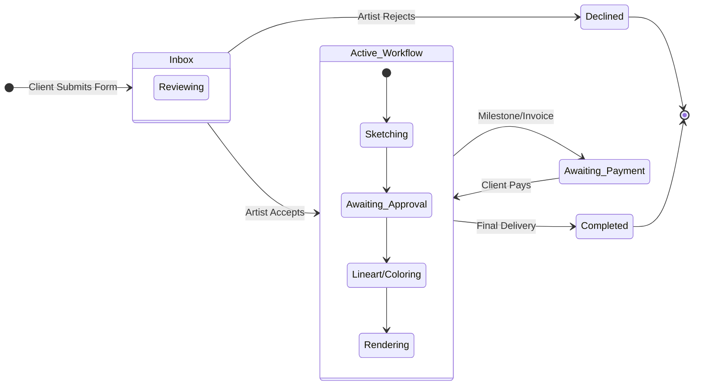
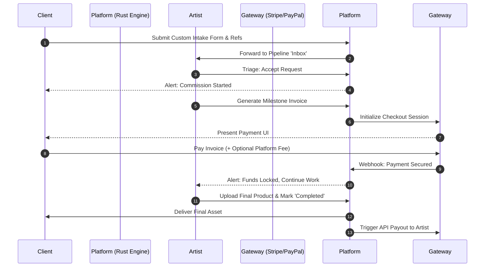
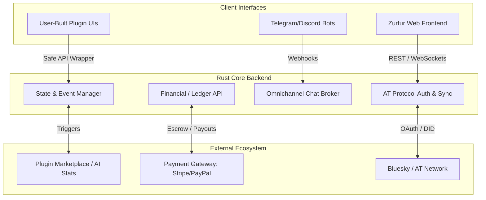

# Zurfur - Comprehensive Design Document

## Table of Contents

- [Part 1: High-Level Overview](#part-1-high-level-overview)
- [Part 2: Feature Breakdown & Core Mechanics](#part-2-feature-breakdown--core-mechanics)
- [Part 3: User Journey & Workflow](#part-3-user-journey--workflow)
- [Part 4: UI/UX & Art Direction](#part-4-uiux--art-direction)
- [Part 5: Technical Architecture & Systems](#part-5-technical-architecture--systems)
- [Part 6: Monetization & Roadmap](#part-6-monetization--roadmap)

---

## Part 1: High-Level Overview

### 1.1 Project Title

**Zurfur** ([Zurfur.app](https://zurfur.app))

### 1.2 Elevator Pitch

Zurfur is a decentralized art commission platform specifically tailored for the furry community. Built on the AT Protocol, it acts as a secure, feature-rich bridge between artists and clients while ensuring true data sovereignty. Unlike traditional walled-garden platforms, Zurfur guarantees that users own their portfolios, commission histories, and reputations.

### 1.3 Core Concept

The primary goal of Zurfur is to facilitate the art commission process without locking users into a centralized ecosystem. It provides the tools necessary to manage complex commissions (like handling reference sheets and specific workflow statuses) while acting purely as a service provider rather than a data jailer.

### 1.4 Target Audience

- **Furry Artists & Makers:** Creators looking for a streamlined, organized way to manage incoming commission requests, track progress, and build a portable reputation. This includes digital artists, traditional artists, and physical crafters (e.g., fursuit makers, sculptors, badge makers).
- **Furry Art Clients/Commissioners:** Users looking to easily commission works, provide character references, track the status of their paid work, and maintain a history of their commissioned pieces.

### 1.5 Design Philosophy & Pillars

- **Convenience Through Consolidation (The "Super App" Model):** Zurfur does not aim to reinvent the wheel or introduce unnecessarily groundbreaking new paradigms. Instead, its core value lies in taking proven, existing tools (Kanban boards, invoicing, chat, custom profiles) and centralizing them into one seamless, convenient platform. It acts as a modular "Super App" specifically built for the creator economy.
- **Plugin-Encouraged Design:** Zurfur is designed to function similarly to a giant, collaborative open-source project. The community is actively encouraged to build, share, and monetize custom tools, views, and integrations.
- **Data-Driven Strategy:** By surfacing transparent, month-to-month statistics, Zurfur empowers both artists and clients to make safe, strategic decisions based on historical data rather than guesswork.
- **Data Sovereignty First:** Users retain absolute control over their information. The platform serves the user, not the other way around.
- **Protocol-Based Architecture:** By leveraging the AT Protocol (the technology powering Bluesky), Zurfur prioritizes interoperability, portability, and resilience.

---

## Part 2: Feature Breakdown & Core Mechanics

This section details the granular feature modules that make up the Zurfur platform.

### Feature 1: AT Protocol Auth & Bluesky Integration

- **1.1 Frictionless Onboarding (Bluesky OAuth):** Users bypass traditional registration. Login is handled entirely via Bluesky OAuth, utilizing the user's Decentralized Identifier (DID) to securely port their existing identity to the platform.
- **1.2 Bi-Directional Data Sync:** Information is seamlessly shared between Zurfur and Bluesky. Artists can automatically cross-post commission openings, completed artwork, or status updates directly to their Bluesky feed from the Zurfur dashboard.
- **1.3 Social Graph Import:** The platform reads the user's existing AT Protocol social graph, instantly recognizing established "Follows" and "Mutuals" without requiring users to rebuild their network from scratch.
- **1.4 Native Social Integration:** Bluesky feeds and Direct Messages (DMs) are integrated natively into the Zurfur UI, allowing it to function as a full social media client while focusing its custom tools on the art economy.

### Feature 2: Identity & Profile Engine

- **2.1 Flat Account Hierarchy:** Every account is natively a Base User. The "Artist" role is merely a modular extension of tools toggled on by the user, requiring no secondary account creation.
- **2.2 Profile Customization (The Toyhouse Model):** Users have deep control over their profile and character pages (colors, CSS, layout).
- **2.3 The "Universal Layout" Safety Fallback:** A mandatory, highly visible toggle that instantly strips all custom user code from a profile, reverting it to the platform's clean, safe, and accessible default theme.
- **2.4 SFW/NSFW Viewer Control:** A strict, viewer-controlled toggle (defaulting to SFW) that filters character galleries, portfolios, and active commissions.
- **2.5 Character Repositories:** Dedicated sub-profiles for original characters, storing reference sheets, hex codes, species info, and linked galleries.

### Feature 3: The Headless Commission Engine (The "Card")

- **3.1 Event-Driven Cards:** Commissions are self-contained data objects. Every action (comment, payment, file upload) is an "Event" appended to an immutable history log, serving as a single source of truth for dispute resolution.
- **3.2 Shapeless Data Attachments:** Cards accept any arbitrary data attachments (high-res files, PDFs, original intake form JSON data).
- **3.3 Customizable State Machine:** Artists dictate the specific pipeline stages (e.g., "Inbox" -> "Sketching" -> "Paid" -> "Delivered").
- **3.4 Deadline & Time Tracking:** Automated triggers that flag cards as "Late" or measure turnaround analytics based on start and end timestamps.
- **3.5 Multi-Party Collaboration:** Cards support many-to-many relationships, allowing multiple artists to collaborate on a piece, or multiple users to co-commission a group piece, with shared visibility for all involved.

### Feature 4: Financial & Payment Gateway

- **4.1 Platform Intermediary (Escrow-Lite):** Zurfur acts as the merchant of record. Clients pay the platform; the platform holds/tracks the funds and automatically issues payouts to the artist upon completion/milestones, minimizing chargeback fraud.
- **4.2 Flexible Invoicing:** Support for multiple invoices per Card.
- **4.3 Installments & Subscriptions:** Support for timed/automated billing cycles (e.g., partial payments once a month).
- **4.4 Voluntary Fee Coverage:** A checkout toggle allowing buyers to voluntarily absorb platform transaction fees so the artist retains 100% of their quote.

### Feature 5: Omnichannel Communications

- **5.1 Isolated Card Chat:** A private messaging thread bound specifically to a Commission Card for casual WIP sharing and communication (distinct from the formal, immutable event history).
- **5.2 Omnichannel Sync (API Abstraction):** The chat logic is abstracted, allowing bots to "subscribe" to a card. This enables users to link their Telegram, Discord, or Matrix accounts to send/receive Zurfur messages via third-party apps without opening the website.

### Feature 6: The Plugin Ecosystem

- **6.1 User-Generated Plugins:** A marketplace where the community can upload custom Kanban views, workflow automation scripts, or UI themes that hook securely into the Headless Engine API.
- **6.2 Native Statistical AI Plugins:** Premium analytical tools (non-generative). Features include market price suggestions, queue completion forecasting, and profile engagement tracking.

### Feature 7: Community & Analytics

- **7.1 Commission Subscriptions:** Push notifications triggered when a specific artist opens their commission queue.
- **7.2 Gamification:** XP, Badges, and Community Rewards for successful transactions and positive platform interactions.
- **7.3 The Strategy Engine (Open Metrics):** Open, reproducible month-to-month statistics. Clients can see artist turnaround trends/price drops; Artists receive "Risk Assessment" warnings for clients with a history of disputes or late payments.

### Feature 8: Search & Discovery

- **8.1 Artist Search:** Users can find artists by tag, art style, species specialty, price range, and availability status. Supports full-text and faceted filtering.
- **8.2 Tag Taxonomy:** A structured, community-curated tag system covering species, art style, medium, and content rating. Tags are used consistently across artist profiles, character repositories, and the future gallery.
- **8.3 Recommendation Engine:** Personalized suggestions based on commission history, followed artists, and character species. Surfaces relevant artists a user may not have discovered organically.
- **8.4 "Open Now" Feed:** A real-time, filterable feed of artists currently accepting commissions, sorted by recency and optionally by relevance to the user's preferences.

### Feature 9: Notification System

- **9.1 In-App Notification Center:** A unified notification feed (bell icon, unread count) categorized by type: commission updates, payments, social interactions, and system alerts.
- **9.2 Push Notifications:** Browser and mobile push for critical events (payment received, commission state change, new message in card chat).
- **9.3 Email Digests:** Configurable email summaries (daily/weekly) aggregating commission activity, new followers, and marketplace updates.
- **9.4 Webhook Notifications:** A developer-facing API allowing plugins and external integrations to subscribe to specific event types programmatically.

### Feature 10: Artist Terms of Service (TOS) Management

- **10.1 TOS Builder:** A structured editor for artists to define their rules, boundaries, refund policy, usage rights, and communication expectations.
- **10.2 TOS Versioning:** Immutable snapshots of each TOS revision. The specific version a client agreed to at the time of commission submission is preserved and linked to the Card's audit trail.
- **10.3 Mandatory Acknowledgment:** Clients must explicitly accept the artist's current TOS before submitting a commission request. This acceptance is recorded as a formal event on the Card.
- **10.4 TOS Diff View:** A visual comparison tool showing what changed between TOS versions, so returning clients can quickly review updates before re-commissioning.

### Feature 11: Content Moderation & Trust/Safety

- **11.1 User Reporting:** Any user can report profiles, commission cards, chat messages, or gallery content for policy violations (harassment, scams, undisclosed NSFW, IP theft).
- **11.2 Block & Mute:** User-level controls to prevent interaction. Blocking prevents all contact and hides the blocked user's content; muting silently suppresses notifications without alerting the other party.
- **11.3 DMCA/Takedown Flow:** A formal, documented process for copyright claims on uploaded content, including counter-notification support, aligned with legal requirements.
- **11.4 Content Flagging:** A combination of automated heuristics (e.g., untagged NSFW detection) and manual community flagging, feeding into the moderation queue (see Feature 13).

### Feature 12: Dispute Resolution

- **12.1 Dispute Filing:** Either party (artist or client) can open a formal dispute on an active commission card. Filing a dispute freezes any pending fund releases until resolution.
- **12.2 Evidence Submission:** Both parties submit evidence referencing the Card's immutable event history (timestamps, state changes, chat logs, file deliveries). The audit trail serves as the objective record.
- **12.3 Resolution Flow:** A structured mediation process: automated resolution for clear-cut cases (e.g., no delivery after deadline + paid invoice), escalation to platform review for complex disputes.
- **12.4 Refund & Payout Policies:** Clear rules for partial refunds based on milestone completion, time invested, and deliverables provided. Policies are transparent and referenced during dispute resolution.

### Feature 13: Platform Administration

- **13.1 User Management Dashboard:** Internal tooling to view, suspend, or ban accounts, audit user activity, and manage role escalations.
- **13.2 Financial Auditing:** Transaction logs, payout tracking, fee reconciliation, and fraud detection dashboards for the operations team.
- **13.3 Moderation Queue:** A centralized queue for reviewing reported content, active disputes, flagged accounts, and DMCA claims. Supports priority sorting and assignment to moderators.
- **13.4 System Health & Metrics:** API performance monitoring, error rate tracking, active user counts, and infrastructure health dashboards.

---

## Part 3: User Journey & Workflow

### 3.1 Frictionless Onboarding (AT Protocol & Bluesky OAuth)

Users skip standard registration. They log in via existing Bluesky credentials (OAuth). Their DID (Decentralized Identifier) and profile metadata port over instantly, establishing immediate trust.

### 3.2 The Critical Route (MVP Core Sequence)

The absolute minimum viable path that must function end-to-end without failure to ensure platform viability.

### 3.3 The Commissioner's Journey (Extended Client Flow)

1. **Discovery:** User browses character galleries or tag-based searches to find an open artist.
2. **Review:** User checks the artist's Statistical Engine data (average turnaround time) and views their TOS.
3. **Application:** User attaches a native Character Profile to an intake form.
4. **Tracking & Chat:** User monitors state changes on their dashboard and communicates with the artist via the synced Telegram bot.
5. **Completion:** Upon delivery, the user optionally features the artwork in their public gallery and cross-posts to their Bluesky feed.

### 3.4 The Artist's Journey (Extended Creator Flow)

1. **Opening Gates:** Artist toggles status to "Open," automatically pinging Subscribers and optionally posting an update to their Bluesky feed.
2. **Risk Assessment:** Artist reviews incoming cards, checking the client's platform reputation (dispute history).
3. **Active Workflow:** Artist utilizes keyboard-driven headless views to drag cards through stages.
4. **Delivery & Gamification:** Final delivery locks the card history, releases funds, and awards both parties platform XP.

---

## Part 4: UI/UX & Art Direction

### 4.1 Power-User & Keyboard-First Design

Efficiency is paramount. The interface is engineered to be entirely navigable without a mouse.

- **Global Command Palette:** `Cmd/Ctrl + K` to instantly jump to profiles, active cards, or trigger plugins.
- **Vim-Style Pipeline:** Navigate headless boards using `h`, `j`, `k`, `l`. Move cards via `Shift + Arrow`.
- **Custom Keybinds:** Power users can map repetitive actions (e.g., "Generate Invoice") to custom shortcuts.

### 4.2 Visual Identity & Aesthetics

- **Core Color Palette:** A sleek, high-contrast base of Black and White, heavily accented with vibrant Gold and Skyblue/Blue. This provides a premium, recognizable backdrop that makes uploaded artwork stand out while maintaining a distinct platform identity.
- **Universal Layout Baseline:** The core platform UI is minimalist and information-dense, prioritizing readability of the complex headless pipelines and statistical graphs.

### 4.3 Mobile-First & Progressive Web App (PWA)

The frontend is developed with a **mobile-first** approach, ensuring the UI is designed for small screens first and scales up to desktop. The application is delivered as a **Progressive Web App (PWA)**, providing:

- **Installable Experience:** Users can add Zurfur to their home screen on any device without app store distribution — bypassing platform gatekeeping that often restricts NSFW-capable applications.
- **Push Notifications:** Service worker-powered push notifications for commission updates, payments, and messages (directly supporting Feature 9).
- **Offline Resilience:** Cached assets and read-only offline access to portfolios, character sheets, and commission history via service worker strategies.
- **Responsive Layouts:** Touch-first interaction patterns (swipe to move cards, pull-to-refresh) that gracefully enhance to keyboard-first power-user controls on desktop.

> **Note:** The Rust backend is fully headless and API-first. It is entirely agnostic to the client consuming it. The PWA frontend is simply one client — third-party apps, plugin UIs, and native mobile apps can all consume the same API.

---

## Part 5: Technical Architecture & Systems

### 5.1 Headless Core & API-First Design

Given the absolute necessity for extreme security, memory safety, and high concurrency (handling real-time chats, financial webhooks, and event streams), the core backend engine is built using Rust. The frontend web application is simply one "client" consuming these APIs.

### 5.2 The Plugin Framework

Plugins are isolated modules interacting via safe webhooks.

- **UI Plugins:** Modify presentation (e.g., Gantt chart views).
- **Logic Plugins:** Automate responses (e.g., `If InvoicePaid == True -> Move Card to Sketching`).
- **Integration Plugins:** Bridge core features with external services.

### 5.3 Decentralized Data (AT Protocol)

User identities and social graphs are anchored to the AT Protocol, ensuring core identities remain intact and portable even outside the Zurfur ecosystem.

---

## Part 6: Monetization & Roadmap

### 6.1 Monetization Strategy (Transaction-Based)

Zurfur prioritizes creator retention through a straightforward, transaction-based model:

- **Internal Transaction Fees:** A minimal fee applied to financial transactions (commissions, marketplace purchases) to cover the overhead of acting as the secure merchant of record. Clients can opt to cover this fee.
- **The Plugin Marketplace:** The platform takes a standard marketplace cut on community-developed plugins, themes, and automation scripts.
- **Premium Native AI Plugins:** Subscriptions or one-time fees for advanced statistical/analytical forecasting tools.

### 6.2 Future Expansion (The "Super App" Horizon)

- **Integrated Tag-Based Art Gallery (e621 Style):** A robust, heavily searchable image board natively tied to artist profiles and character sheets.
- **Community Knowledge Base (Wiki) & Forums:** A dedicated wiki for documenting original species lore or plugin manuals, alongside traditional forums for long-form critiques and support.
- **Expanded Global Payouts & Crypto:** Integrating cryptocurrency payments and alternative gateways to support artists in heavily sanctioned or restricted regions.
- **Community-Safe Advertising Ecosystem:** Ethical, non-intrusive ad placements (e.g., boosting "Open for Commissions" status) to subsidize server costs and lower baseline transaction fees.
