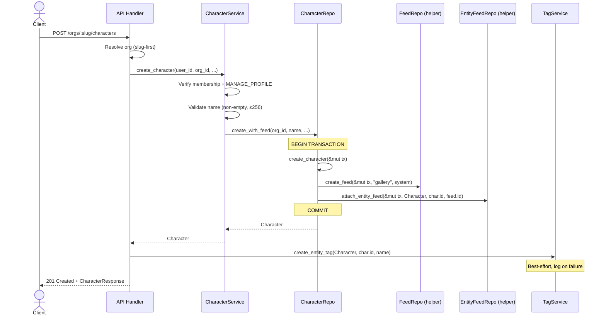
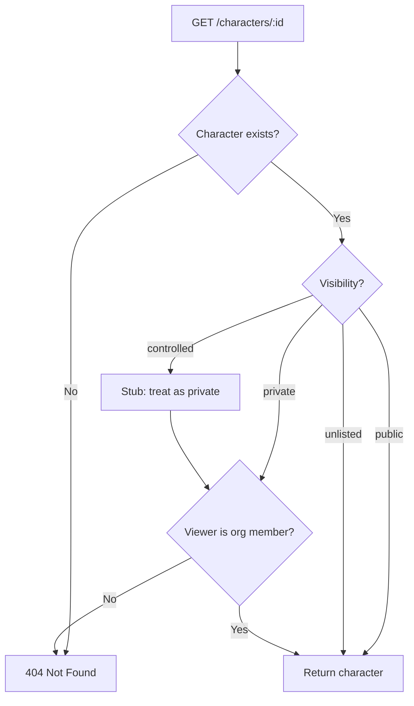
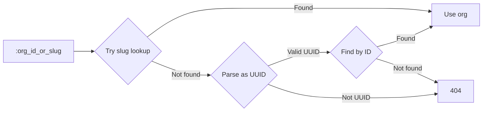

# Feature 2 Phase 3: Characters (Core)

> **Created 2026-04-14**

## Overview

Characters are original characters (OCs) owned by orgs. They follow the same architectural pattern as organizations: described by tags (species, colors, art style), content delivered through feeds (gallery), and connected via polymorphic junctions. The system doesn't interpret character data — description, species, and art style are user-facing concerns stored as text and tags.

Users attach their characters to commission requests. Each character gets a gallery feed on creation (a package — the feed cannot exist without the character). Ref sheets are feed items tagged with `ref_sheet` metadata.

## Entity Relationship

```mermaid
erDiagram
    character {
        UUID id PK
        UUID org_id FK
        TEXT name "max 256, Unicode"
        TEXT description "nullable, markdown"
        content_rating content_rating "sfw | questionable | nsfw (required)"
        character_visibility visibility "public | private | controlled | unlisted"
        TIMESTAMPTZ created_at
        TIMESTAMPTZ updated_at
        TIMESTAMPTZ deleted_at "nullable, soft delete"
    }

    organization ||--o{ character : "owns"

    character ||--|| entity_feed : "gallery feed"
    character ||--o{ entity_tag : "species, art style, etc."

    entity_feed {
        UUID feed_id PK_FK
        TEXT entity_type "character"
        UUID entity_id
    }

    entity_tag {
        TEXT entity_type "character"
        UUID entity_id
        UUID tag_id PK_FK
    }

    tag ||--o{ entity_tag : ""
    feed ||--|| entity_feed : ""
```

### What already exists

The codebase is prepared for characters through the unified entity discriminator. Character support is provided by `EntityKind::Character`:

| Enum | Variant | Status |
|------|---------|--------|
| `EntityKind` | `Character` | Exists |
| `TagCategory` | `Character` | Exists |
| `ContentRating` | `Sfw`, `Questionable`, `Nsfw` | Exists |

## Character Creation Flow



## Visibility Model



`controlled` visibility is defined in the enum but deferred — behaves as `private` until the access control table is built.

### Visibility in listings

`GET /orgs/:slug/characters` applies visibility filtering:
- **Org members** see all characters (public + private + unlisted + controlled)
- **Non-members** see only `public` characters (not `unlisted` — unlisted requires the direct link)

## Org Resolution (slug-first)

Nested routes accept either a slug or UUID for the org parameter. Resolution order: **slug first, then UUID**. Slugs are copy-pasted more frequently than UUIDs.



## API Routes

### Org-scoped

| Method | Path | Auth | Permission | Description |
|--------|------|------|-----------|-------------|
| `POST` | `/orgs/:org/characters` | Required | `MANAGE_PROFILE` | Create character |
| `GET` | `/orgs/:org/characters` | Optional | — | List characters (filtered by visibility) |

**Query params for listing:** `limit`, `offset`, `content_rating`, `tags` (comma-separated UUIDs)

### Top-level

| Method | Path | Auth | Permission | Description |
|--------|------|------|-----------|-------------|
| `GET` | `/characters/:id` | Optional | — | Get character (visibility-gated) |
| `PATCH` | `/characters/:id` | Required | `MANAGE_PROFILE` | Update character |
| `DELETE` | `/characters/:id` | Required | `MANAGE_PROFILE` | Soft delete |

### Response shape

Flat responses only. Tags and feeds fetched via existing endpoints:
- `GET /characters/:id` → `CharacterResponse` (character fields only)
- Tags via existing tag endpoints with entity filter
- Feeds via existing feed endpoints with entity filter

## Soft Delete Behavior

When a character is soft-deleted (`deleted_at` set):
- Character disappears from all listings and direct GET (returns 404)
- Gallery feed becomes inaccessible (character and feed are a package)
- Tags stay attached to artwork but are hidden (usage_count unchanged)
- If the character is restored (deleted_at cleared), everything becomes visible again
- **Hard delete is a separate, explicit future feature** — it cascades tag detachment from all artwork and is irreversible

## Tag Attachment

For the initial implementation, tag attachment is **locked to org members** with `MANAGE_PROFILE` permission. Uses existing tag endpoints.

Future modes (deferred, per-org configuration):
- **Community tagging:** Any authenticated user can attach tags
- **Approval-based:** Anyone can suggest, org members approve
- **Locked:** Org members only (current default)

## Decisions

| Decision | Rationale |
|----------|-----------|
| One feed per character (gallery) | Ref sheets are feed items tagged `ref_sheet` (`TagCategory::Metadata`). No separate feed needed. |
| Visibility as PG ENUM, not bool | Four distinct access levels. `controlled` deferred but enum value reserved. |
| `content_rating` required, no default | Explicit user choice — no accidental SFW/NSFW misclassification. |
| Description as TEXT column, not feed | Simpler for core. Org bios use feeds, but migrating later is straightforward. |
| Slug-first org resolution | Slugs appear in URLs and are copy-pasted. UUIDs are a fallback for programmatic access. |
| Flat API responses | TTI matters more than round-trip count. Frontend can parallel-fetch character + tags + feeds. |
| `org_id` as FK to organization | Characters are owned children of orgs (like org members), not independent aggregates linked via junction. |

## Deferred Scope

- `character_access` table for `controlled` visibility
- Community / approval-based tagging modes
- Hard delete with cascading tag detachment
- Description as feed (template support, version history)
- Feed event propagation to org feeds
- Character customization (CSS/layout)
- S3 file storage for reference sheet images
- Profile SEO, Bluesky profile import
