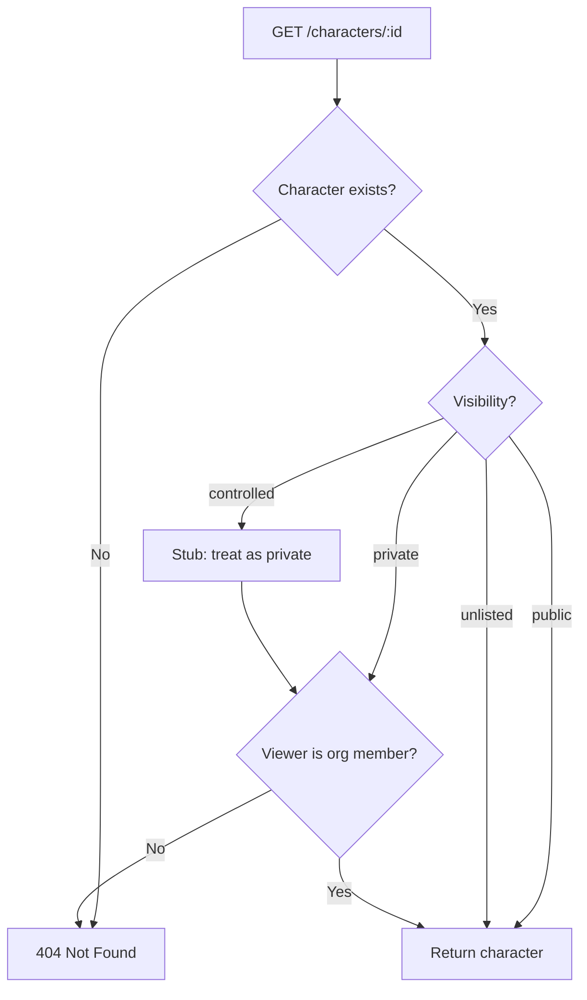
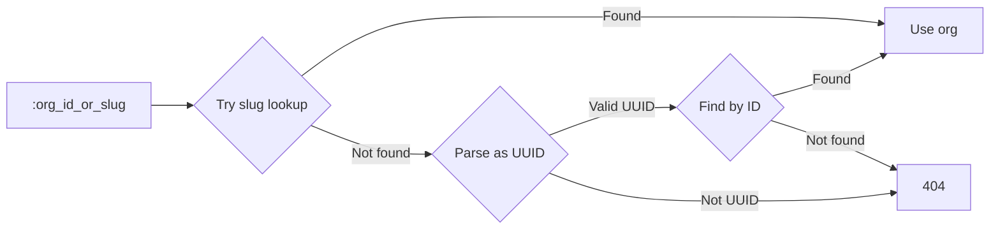

# Feature 2 Phase 3: Characters (Core)

> **Created 2026-04-14 | Updated 2026-04-15** — Updated for EntityKind unification and gallery-as-filtered-feed shift.

## Overview

Characters are original characters (OCs) owned by orgs. They follow the same architectural pattern as organizations: described by tags (species, colors, art style) and connected via polymorphic junctions. The system doesn't interpret character data — description, species, and art style are user-facing concerns stored as text and tags.

Users attach their characters to commission requests. Characters implement the `Entity`, `Taggable`, and `FeedOwnable` traits from the entity interface system.

### Gallery Model (Updated)

A character's gallery is a **filtered view of the Organization's feed**, not a separate feed. Content is posted to the org's feed and tagged with the character. The character's "gallery" is a query: org feed items tagged with character X.

This follows the domain principle that entities are atomic and feeds belong to orgs. It's simpler than separate character feeds and avoids duplication.

## WORKBOARD Unit

This design doc covers **Phase 2B** (`feature/characters-domain`) — domain entity, migration, and repository only. The service and API layers are **Phase 3D** (`feature/characters-api`).

### Prerequisites

- **Phase 1A (Entity Interfaces)** must be merged — Characters use `EntityKind`, `Entity` trait, `Taggable` trait, `FeedOwnable` trait.

## Entity Relationship

```mermaid
erDiagram
    character {
        UUID id PK
        UUID org_id FK
        TEXT name "max 256, Unicode"
        TEXT description "nullable, markdown"
        content_rating content_rating "sfw | questionable | nsfw (required)"
        character_visibility visibility "public | private | controlled | unlisted"
        TIMESTAMPTZ created_at
        TIMESTAMPTZ updated_at
        TIMESTAMPTZ deleted_at "nullable, soft delete"
    }

    organization ||--o{ character : "owns"

    character ||--o{ entity_tag : "species, art style, etc."

    entity_tag {
        TEXT entity_type "character"
        UUID entity_id
        UUID tag_id PK_FK
    }

    tag ||--o{ entity_tag : ""
```

Note: No `entity_feed` relationship for characters. The gallery is a filtered view of the org's feed, not a separate feed owned by the character.

### What already exists (after Entity Interfaces merge)

| Item | Status |
|------|--------|
| `EntityKind::Character` | Exists (from entity interfaces) |
| `TagCategory::Character` | Exists |
| `ContentRating` enum | Exists |
| `Entity` / `Taggable` / `FeedOwnable` traits | Exists (from entity interfaces) |
| `Permissions::MANAGE_PROFILE` | Exists |

## Codebase State (for implementation instance)

### Architecture

```
backend/crates/
  domain/        # Pure entities, traits, errors (no I/O)
  persistence/   # SQLx PostgreSQL repos, migrations
  application/   # Services (Phase 3D, not this unit)
  api/           # Routes (Phase 3D, not this unit)
```

### Patterns to Follow

**Entity struct pattern** — see `domain/src/organization.rs`:
- Struct with `id: Uuid`, fields, timestamps
- Doc comment explaining architecture decisions
- `impl Entity`, `impl Taggable`, `impl FeedOwnable` from `domain/src/entity.rs`

**Enum pattern** — see `domain/src/content_rating.rs`:
- `as_str()` / `from_str()` / `From` / `TryFrom` impls
- Round-trip test

**Repository trait pattern** — see `domain/src/organization.rs`:
- `#[async_trait]` trait in domain
- Persistence methods (single SQL operation, executor-generic)
- Action methods (multi-operation transaction)

**SQLx repository pattern** — see `persistence/src/repositories/organization_repository.rs`:
- `new(pool)` constructor
- `from_pool() -> Arc<dyn Trait>` convenience
- Row mapper function parsing enums via `from_str()`

---

## Phase 2B Scope — Domain + Persistence

### New: `domain/src/character.rs`

**CharacterVisibility enum:**
```rust
pub enum CharacterVisibility {
    Public,
    Private,
    Controlled,
    Unlisted,
}
```
With `as_str()` / `from_str()` / `From` / `TryFrom`. Backed by new `character_visibility` PG ENUM.

**Character struct:**
```rust
pub struct Character {
    pub id: Uuid,
    pub org_id: Uuid,
    pub name: String,
    pub description: Option<String>,  // markdown
    pub content_rating: ContentRating,
    pub visibility: CharacterVisibility,
    pub created_at: DateTime<Utc>,
    pub updated_at: DateTime<Utc>,
    pub deleted_at: Option<DateTime<Utc>>,
}
```

**Trait implementations:**
- `Entity` → `entity_kind()` returns `EntityKind::Character`
- `Taggable` → default `validate_tag()` / `validate_untag()` (allow all)
- `FeedOwnable` → default `validate_feed_creation()` / `validate_feed_deletion()` (allow all)

**CharacterError enum:**
```rust
pub enum CharacterError {
    NotFound,
    Database(String),
}
```

**CharacterRepository trait:**
- `create(org_id, name, description, content_rating, visibility)` → `Character`
- `find_by_id(id)` → `Option<Character>` (excludes soft-deleted)
- `list_by_org(org_id, limit, offset, content_rating?, tag_ids?)` → `Vec<Character>` — paginated with optional filters
- `update(id, name, description, content_rating, visibility)` → `Character`
- `soft_delete(id)` → `()`

Note: **No `create_with_feed` action method.** The gallery is a filtered view of the org's feed, not a separate feed. Character creation is a single insert.

### New: Migration

```sql
CREATE TYPE character_visibility AS ENUM ('public', 'private', 'controlled', 'unlisted');

CREATE TABLE character (
    id              UUID PRIMARY KEY DEFAULT gen_random_uuid(),
    org_id          UUID NOT NULL REFERENCES organization(id),
    name            TEXT NOT NULL,
    description     TEXT,
    content_rating  content_rating NOT NULL,
    visibility      character_visibility NOT NULL,
    created_at      TIMESTAMPTZ NOT NULL DEFAULT now(),
    updated_at      TIMESTAMPTZ NOT NULL DEFAULT now(),
    deleted_at      TIMESTAMPTZ
);

CREATE INDEX idx_character_org_id ON character (org_id);
```

### New: `persistence/src/repositories/character_repository.rs`

Standard SqlxCharacterRepository following the existing pattern:
- `new(pool)`, `from_pool() -> Arc<dyn CharacterRepository>`
- Row mapper: `map_character(row)` parsing `content_rating` and `visibility` via `from_str()`
- `list_by_org` with dynamic query building for optional filters:
  - `WHERE org_id = $1 AND deleted_at IS NULL`
  - Optional: `AND content_rating = $N`
  - Optional: `AND id IN (SELECT entity_id FROM entity_tag WHERE entity_type = 'character' AND tag_id = ANY($N))`
  - `ORDER BY created_at DESC LIMIT $N OFFSET $N`

### Modified: Registration files

- `domain/src/lib.rs` — add `pub mod character;`
- `persistence/src/repositories/mod.rs` — add `character_repository` module, export `SqlxCharacterRepository`
- `persistence/src/lib.rs` — export `Character`, `CharacterError`, `CharacterRepository`, `CharacterVisibility`, `SqlxCharacterRepository`

---

## Test Plan (Phase 2B)

### Unit Tests (domain)

| Test | What it verifies |
|------|-----------------|
| `character_visibility_round_trip` | All 4 variants survive `as_str()` → `from_str()` |
| `character_visibility_from_str_unknown` | Unknown strings return `None` |
| `character_entity_kind` | `Character` returns `EntityKind::Character` from `entity_kind()` |
| `character_entity_id` | `Character` returns correct UUID from `id()` |
| `character_taggable_defaults` | `validate_tag()` and `validate_untag()` return `Ok(())` |
| `character_feed_ownable_defaults` | `validate_feed_creation()` and `validate_feed_deletion()` return `Ok(())` |

### Integration Tests (persistence, `sqlx::test`)

| Test | What it verifies |
|------|-----------------|
| `create_character` | Insert character, verify all fields round-trip |
| `find_character_by_id` | Create, then find by UUID |
| `find_deleted_character_returns_none` | Soft-deleted character not returned by `find_by_id` |
| `list_by_org_basic` | Create 3 characters, list returns all 3 |
| `list_by_org_excludes_deleted` | Soft-deleted characters excluded from listing |
| `list_by_org_filter_content_rating` | Filter by `content_rating = sfw` |
| `list_by_org_filter_tags` | Filter by tag UUIDs (requires tag setup) |
| `list_by_org_pagination` | `limit=2, offset=1` returns correct slice |
| `update_character` | Change name, description, visibility. Verify `updated_at` changes. |
| `soft_delete_character` | Set `deleted_at`, verify not found |
| `character_requires_valid_org` | FK constraint: inserting with nonexistent org_id fails |
| `character_content_rating_enum` | All 3 content_rating values accepted |
| `character_visibility_enum` | All 4 visibility values accepted |

---

## Visibility Model



`controlled` visibility is defined in the enum but deferred — behaves as `private` until the access control table is built.

### Visibility in listings

`GET /orgs/:slug/characters` applies visibility filtering:
- **Org members** see all characters (public + private + unlisted + controlled)
- **Non-members** see only `public` characters (not `unlisted` — unlisted requires the direct link)

## Org Resolution (slug-first)

Nested routes accept either a slug or UUID for the org parameter. Resolution order: **slug first, then UUID**. Slugs are copy-pasted more frequently than UUIDs.



## API Routes (Phase 3D — not this unit)

### Org-scoped

| Method | Path | Auth | Permission | Description |
|--------|------|------|-----------|-------------|
| `POST` | `/orgs/:org/characters` | Required | `MANAGE_PROFILE` | Create character |
| `GET` | `/orgs/:org/characters` | Optional | — | List characters (filtered by visibility) |

**Query params for listing:** `limit`, `offset`, `content_rating`, `tags` (comma-separated UUIDs)

### Top-level

| Method | Path | Auth | Permission | Description |
|--------|------|------|-----------|-------------|
| `GET` | `/characters/:id` | Optional | — | Get character (visibility-gated) |
| `PATCH` | `/characters/:id` | Required | `MANAGE_PROFILE` | Update character |
| `DELETE` | `/characters/:id` | Required | `MANAGE_PROFILE` | Soft delete |

### Response shape

Flat responses only. Tags fetched via existing tag endpoints with entity filter:
- `GET /characters/:id` → `CharacterResponse` (character fields only)
- Tags via `GET /tags/entity/character/:id`
- Gallery via org feed items filtered by character tag

## Soft Delete Behavior

When a character is soft-deleted (`deleted_at` set):
- Character disappears from all listings and direct GET (returns 404)
- Tags stay attached to artwork but are hidden (usage_count unchanged)
- If the character is restored (deleted_at cleared), everything becomes visible again
- **Hard delete is a separate, explicit future feature** — it cascades tag detachment from all artwork and is irreversible

## Decisions

| Decision | Rationale |
|----------|-----------|
| Gallery = filtered org feed view | Content is posted to org's feed, tagged with character. Character's gallery is a query, not a separate feed. Simpler, follows domain rules. |
| Visibility as PG ENUM, not bool | Four distinct access levels. `controlled` deferred but enum value reserved. |
| `content_rating` required, no default | Explicit user choice — no accidental SFW/NSFW misclassification. |
| Description as TEXT column, not feed | Simpler for core. Migrating later is straightforward. |
| Slug-first org resolution | Slugs appear in URLs and are copy-pasted. UUIDs are a fallback for programmatic access. |
| Flat API responses | TTI matters more than round-trip count. Frontend can parallel-fetch character + tags. |
| `org_id` as FK to organization | Characters are owned children, not independent aggregates. |
| No `create_with_feed` | Gallery is a filtered view. Character creation is a single insert. |
| Character implements all entity traits | `Entity`, `Taggable`, `FeedOwnable` — even though FeedOwnable is unused initially. |

## Deferred Scope

- `character_access` table for `controlled` visibility
- Community / approval-based tagging modes
- Hard delete with cascading tag detachment
- Description as feed (template support, version history)
- Feed event propagation to org feeds
- Character customization (CSS/layout)
- S3 file storage for reference sheet images
- Profile SEO, Bluesky profile import
