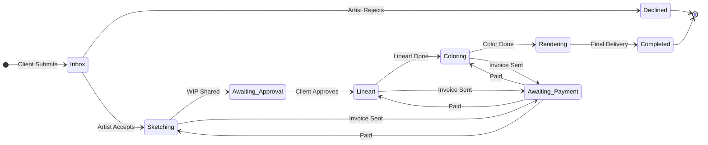

# Feature 3: The Headless Commission Engine (The "Card")

## Overview

The core product of Zurfur. Commissions are self-contained, event-driven data objects ("Cards") that flow through artist-defined pipeline stages. Every action is an immutable event, creating a single source of truth for all parties. The engine is "headless" — the backend manages state and events while the frontend (or plugins) can render any view (Kanban, list, calendar, etc.).

## Sub-features

### 3.1 Event-Driven Cards

**What it is:** Each commission is a Card with an append-only event history. Events include state changes, comments, file uploads, invoice generation, payment receipts, etc.

**Implementation approach:**
- **Domain model:** `Commission` aggregate root. `CommissionEvent` value objects.
- **Event types enum:** `Created`, `StateChanged`, `CommentAdded`, `FileUploaded`, `InvoiceGenerated`, `PaymentReceived`, `DeadlineSet`, `DeadlineMissed`, `ParticipantAdded`, `Completed`, `Cancelled`, `DisputeOpened`
- **Tables:** `commissions` (materialized current state), `commission_events` (append-only log)
- Current state is derived from events but cached in `commissions` table for fast reads
- All state mutations go through event creation — never update `commissions` directly without also appending an event

### 3.2 Shapeless Data Attachments

**What it is:** Cards accept arbitrary file attachments — high-res artwork, PDFs, reference sheets, original intake form JSON.

**Implementation approach:**
- `commission_attachments` table: `id`, `commission_id`, `uploader_id`, `filename`, `mime_type`, `size_bytes`, `storage_key` (S3 path), `metadata_json`, `created_at`
- S3-compatible storage (shared with Feature 2's file storage)
- Upload via presigned URLs (client uploads directly to S3, backend records metadata)
- Virus/malware scanning on upload (ClamAV or similar)

### 3.3 Customizable State Machine

**What it is:** Artists define their own pipeline stages and transitions.

**Implementation approach:**
- `pipeline_templates` table: `id`, `artist_id`, `name`, `stages_json`, `transitions_json`, `is_default`, `created_at`
- `stages_json`: ordered array of stage definitions `[{ "id": "sketching", "label": "Sketching", "color": "#..." }]`
- `transitions_json`: allowed transitions `[{ "from": "sketching", "to": "lineart", "requires_event": null }]`
- Commission creation references a pipeline template
- State change validation: check the transition is allowed before emitting `StateChanged` event
- Default template provided for new artists

### 3.4 Deadline & Time Tracking

**What it is:** Automated triggers that flag cards as "Late" and track turnaround analytics.

**Implementation approach:**
- Fields on `commissions`: `started_at`, `deadline`, `completed_at`
- Background job (tokio interval task): query for commissions where `deadline < now() AND status != completed`. Emit `DeadlineMissed` event for each.
- Turnaround analytics derived from `started_at` → `completed_at` per commission
- Stage-level timing: calculate time spent in each stage from `StateChanged` event timestamps

### 3.5 Multi-Party Collaboration

**What it is:** Many-to-many: multiple artists on a piece, multiple clients co-commissioning, all with shared visibility.

**Implementation approach:**
- `commission_participants` table: `commission_id`, `user_id`, `role` (artist/client/collaborator), `added_at`
- All participants can view the card, its events, and its chat (Feature 5)
- Permission model: artists can change state, clients can approve/pay, collaborators are read-only + chat
- Commission creation allows tagging multiple participants

## Dependencies

### Requires (must be built first)
- [Feature 1.1](../01-atproto-auth/README.md) — authenticated users
- [Feature 2.1](../02-identity-profile/README.md) — user/artist distinction
- [Feature 2.5](../02-identity-profile/README.md) — character profiles (attached to commission requests)
- [Feature 10](../10-artist-tos/README.md) — TOS acceptance required before commission submission
- File storage (S3/MinIO) for attachments

### Enables (unlocked after this is built)
- [Feature 4](../04-financial-gateway/README.md) — invoices attach to cards
- [Feature 5](../05-omnichannel-comms/README.md) — card chat
- [Feature 1.2](../01-atproto-auth/README.md) — cross-post commission openings to Bluesky
- [Feature 7.3](../07-community-analytics/README.md) — analytics from event data
- [Feature 12](../12-dispute-resolution/README.md) — disputes reference card event history

## Implementation Phases

### Phase 1: Core Card & Pipeline
- `Commission` domain entity and `CommissionEvent` value object
- `commissions` and `commission_events` tables
- `pipeline_templates` table with default template
- Commission CRUD: create (from intake form), read, list
- State machine validation and `StateChanged` event emission
- API: `POST /commissions`, `GET /commissions/:id`, `GET /commissions` (list), `POST /commissions/:id/transition`
- Crates: domain (entities), persistence (repositories), application (use cases), api (routes)

### Phase 2: Attachments, Participants & Deadlines
- `commission_attachments` table + S3 upload flow
- `commission_participants` table + multi-party logic
- Deadline tracking + background job for overdue detection
- Intake form system: `commission_intake_forms` table (artist-defined form templates)
- API: file upload, participant management, deadline setting

### Phase 3: Post-implementation
- Event replay/projection tooling for debugging
- Performance: index optimization on `commission_events` for large histories
- Snapshotting strategy for commissions with 100+ events
- Integration tests: full commission lifecycle (create → state transitions → complete)
- Webhook events for state changes (feeds into Feature 6 plugins and Feature 9 notifications)
- Documentation: state machine definition format, event type reference

## Assumptions

- Event sourcing (append-only events + materialized state) is the right pattern for auditability
- Artists will define reasonable state machines (no formal verification beyond cycle detection)
- File storage infrastructure (S3) exists when Phase 2 begins
- A default pipeline template covers 80% of artist workflows
- The `commissions` materialized table is kept in sync via application-level logic, not database triggers

## Shortcomings & Known Limitations

- **Event replay can be slow** for old commissions with many events — may need snapshotting
- **No conflict resolution** for simultaneous state changes — last-write-wins
- **State machine validation is basic** — no formal verification, no guard conditions beyond simple transition rules
- **No undo/rollback** of events (immutable by design) — mistakes require compensating events
- **No archival strategy** for completed commissions (cold storage, data retention)
- **Intake forms** are a mini form-builder, which is complex — may need simplification for MVP
- **No draft commissions** — once created, a card is active
- **Search within events** is not indexed — finding a specific comment in a long history may be slow
