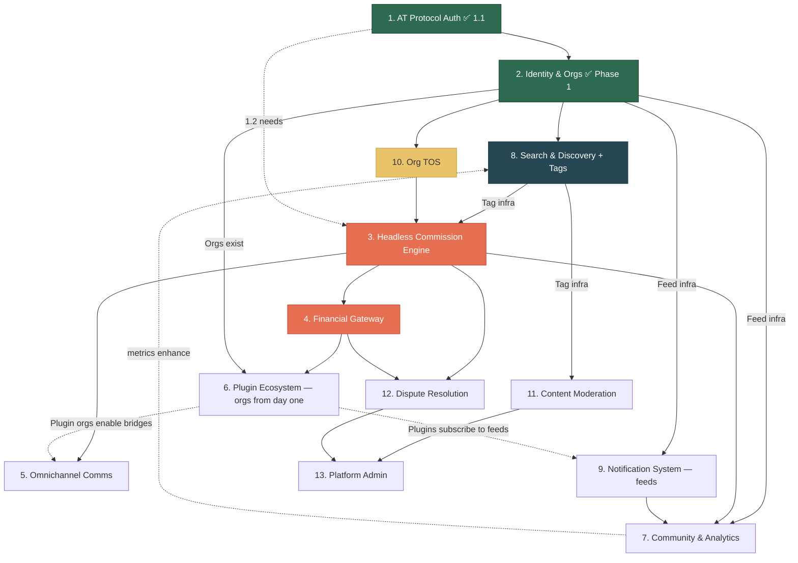

> **Revised 2026-04-08** — Updated for org-centric identity, feed-driven content, headless commissions, and plugin-as-org architecture.

# Zurfur — Feature Dependency Map

This document provides a high-level view of all 13 features, their dependencies, and a recommended implementation order.

## Architectural Foundations

Five root aggregates underpin the platform: **User**, **Organization**, **Feed**, **Commission**, **Tag**.

Key architectural decisions reflected in this plan:
- **Org-centric identity:** User is atomic. All roles/capabilities via org membership. Every user gets a personal org. Artist is an org role.
- **Feeds as universal content container:** Any entity can have feeds via `entity_feeds`. Gallery, portfolio, activity = feed views. Following = feed subscription.
- **Tags over columns:** Descriptive attributes are tags. The tag system is Tier 1 foundational infrastructure.
- **Headless commissions:** Internal state only. Boards are projections. Commission card is a shell with add-on slots.
- **Plugins are orgs:** Subscribe/react/post to feeds. No separate plugin API.
- **Two-tier data:** AT Protocol PDS for public, PostgreSQL for private.

## Feature Index

| # | Feature | Status | Priority |
|---|---------|--------|----------|
| 1 | [AT Protocol Auth & Bluesky Integration](01-atproto-auth/README.md) | 1.1 Done | Critical |
| 2 | [Identity & Profile Engine](02-identity-profile/README.md) | Phase 1 Done | Critical |
| 3 | [The Headless Commission Engine](03-commission-engine/README.md) | Not started | Critical |
| 4 | [Financial & Payment Gateway](04-financial-gateway/README.md) | Not started | Critical |
| 5 | [Omnichannel Communications](05-omnichannel-comms/README.md) | Not started | High |
| 6 | [The Plugin Ecosystem](06-plugin-ecosystem/README.md) | Not started | High |
| 7 | [Community & Analytics](07-community-analytics/README.md) | Not started | Medium |
| 8 | [Search & Discovery](08-search-discovery/README.md) | Not started | Critical |
| 9 | [Notification System](09-notification-system/README.md) | Not started | High |
| 10 | [Organization TOS Management](10-artist-tos/README.md) | Not started | High |
| 11 | [Content Moderation & Trust/Safety](11-content-moderation/README.md) | Not started | High |
| 12 | [Dispute Resolution](12-dispute-resolution/README.md) | Not started | Medium |
| 13 | [Platform Administration](13-platform-admin/README.md) | Not started | High |

## Dependency Graph



**Legend:** Green = done/in-progress, Dark blue = foundational infrastructure, Red = critical path, Yellow = next up, Dashed = soft dependency

## Recommended Implementation Order

### Tier 1 — Foundation (Infrastructure + MVP Critical Path)
Tags and Feeds are foundational infrastructure — other features depend on them. These must work end-to-end for the platform to function.

1. **Feature 1.1** — AT Protocol OAuth ✅ **DONE**
2. **Feature 2 Phase 1** — Identity & Org Engine (users, personal orgs, org membership) ✅ **DONE**
3. **Feature 8.2** — Tag Taxonomy (Tier 1 infrastructure — tags underpin search, moderation, content classification)
4. **Feature 2 Phase 2** — Feed infrastructure (`entity_feeds`, feed views, subscriptions)
5. **Feature 10** — Org TOS (required before commissions can be accepted; published to PDS)
6. **Feature 3** — Headless Commission Engine (card shell + add-on slots)
7. **Feature 4** — Financial Gateway (commissions need payments)
8. **Feature 9** — Notification System (commission updates need delivery; built on feed infrastructure)

### Tier 2 — Core Experience
Features that make the platform usable and competitive.

9. **Feature 5** — Omnichannel Communications (card chat)
10. **Feature 8.1, 8.3, 8.4** — Search, Recommendations, "Open Now" feed view
11. **Feature 11** — Content Moderation (required before public launch; uses tag system for NSFW detection)
12. **Feature 6** — Plugin Ecosystem (plugins are orgs from day one — the org and feed infrastructure already supports them; this tier adds discovery and governance)
13. **Feature 1.2-1.4** — Bluesky sync, social graph, native integration

### Tier 3 — Growth & Trust
Features that build trust and drive engagement.

14. **Feature 7** — Community & Analytics (feed subscriptions, XP for users + orgs, org metrics on PDS)
15. **Feature 12** — Dispute Resolution (user vs org, add-on slots on commission cards)
16. **Feature 13** — Platform Administration (user + org suspensions, plugin org moderation, PDS admin ops)

## The Critical Route

The absolute minimum path from "user signs up" to "artist gets paid":

```
Auth (1.1) → Org (2) → Tags (8.2) → Feeds (2+) → TOS (10) → Commission Card (3) → Invoice (4.2) → Payment (4.1) → Payout (4.1)
```

Every feature on this path is a hard blocker. Nothing downstream works until the upstream feature is complete.

## Root Aggregates

The five root aggregates and where they are introduced:

| Aggregate | Introduced In | Notes |
|-----------|--------------|-------|
| **User** | Feature 1 (Auth) | Atomic identity. All capabilities via org membership. |
| **Organization** | Feature 2 (Identity) | Every user gets a personal org. Artist = org role. Plugin = org. |
| **Feed** | Feature 2+ (Feed infra) | Universal content container via `entity_feeds`. Cross-cutting. |
| **Commission** | Feature 3 (Engine) | Headless card shell with add-on slots. Internal state only. |
| **Tag** | Feature 8.2 (Tags) | Tier 1 infrastructure. All descriptive attributes are tags. |
