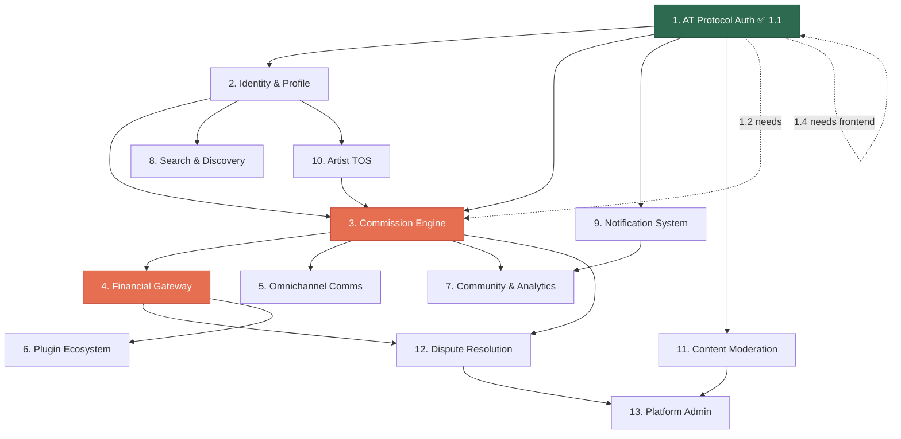

# Zurfur — Feature Dependency Map

This document provides a high-level view of all 13 features, their dependencies, and a recommended implementation order.

## Feature Index

| # | Feature | Status | Priority |
|---|---------|--------|----------|
| 1 | [AT Protocol Auth & Bluesky Integration](01-atproto-auth/README.md) | 1.1 Done | Critical |
| 2 | [Identity & Profile Engine](02-identity-profile/README.md) | Not started | Critical |
| 3 | [The Headless Commission Engine](03-commission-engine/README.md) | Not started | Critical |
| 4 | [Financial & Payment Gateway](04-financial-gateway/README.md) | Not started | Critical |
| 5 | [Omnichannel Communications](05-omnichannel-comms/README.md) | Not started | High |
| 6 | [The Plugin Ecosystem](06-plugin-ecosystem/README.md) | Not started | Medium |
| 7 | [Community & Analytics](07-community-analytics/README.md) | Not started | Medium |
| 8 | [Search & Discovery](08-search-discovery/README.md) | Not started | High |
| 9 | [Notification System](09-notification-system/README.md) | Not started | High |
| 10 | [Artist TOS Management](10-artist-tos/README.md) | Not started | High |
| 11 | [Content Moderation & Trust/Safety](11-content-moderation/README.md) | Not started | High |
| 12 | [Dispute Resolution](12-dispute-resolution/README.md) | Not started | Medium |
| 13 | [Platform Administration](13-platform-admin/README.md) | Not started | High |

## Dependency Graph



**Legend:** Green = done/in-progress, Red = critical path, Dashed = soft dependency

## Recommended Implementation Order

### Tier 1 — Foundation (MVP Critical Path)
These must work end-to-end for the platform to function at all.

1. **Feature 1.1** — AT Protocol OAuth ✅ **DONE**
2. **Feature 2** — Identity & Profile Engine (user/artist roles, character profiles)
3. **Feature 10** — Artist TOS (required before commissions can be accepted)
4. **Feature 3** — Commission Engine (the core product)
5. **Feature 4** — Financial Gateway (commissions need payments)
6. **Feature 9** — Notification System (commission updates need delivery)

### Tier 2 — Core Experience
Features that make the platform usable and competitive.

7. **Feature 5** — Omnichannel Communications (card chat)
8. **Feature 8** — Search & Discovery (finding artists)
9. **Feature 11** — Content Moderation (required before public launch)
10. **Feature 1.2-1.4** — Bluesky sync, social graph, native integration

### Tier 3 — Growth & Trust
Features that build trust and drive engagement.

11. **Feature 7** — Community & Analytics (metrics, gamification)
12. **Feature 12** — Dispute Resolution
13. **Feature 13** — Platform Administration

### Tier 4 — Ecosystem
Features that expand the platform beyond core functionality.

14. **Feature 6** — Plugin Ecosystem

## The Critical Route

The absolute minimum path from "user signs up" to "artist gets paid":

```
Auth (1.1) → Profile (2.1) → Artist Toggle (2.1) → TOS (10) → Commission Card (3) → Invoice (4.2) → Payment (4.1) → Payout (4.1)
```

Every feature on this path is a hard blocker. Nothing downstream works until the upstream feature is complete.
