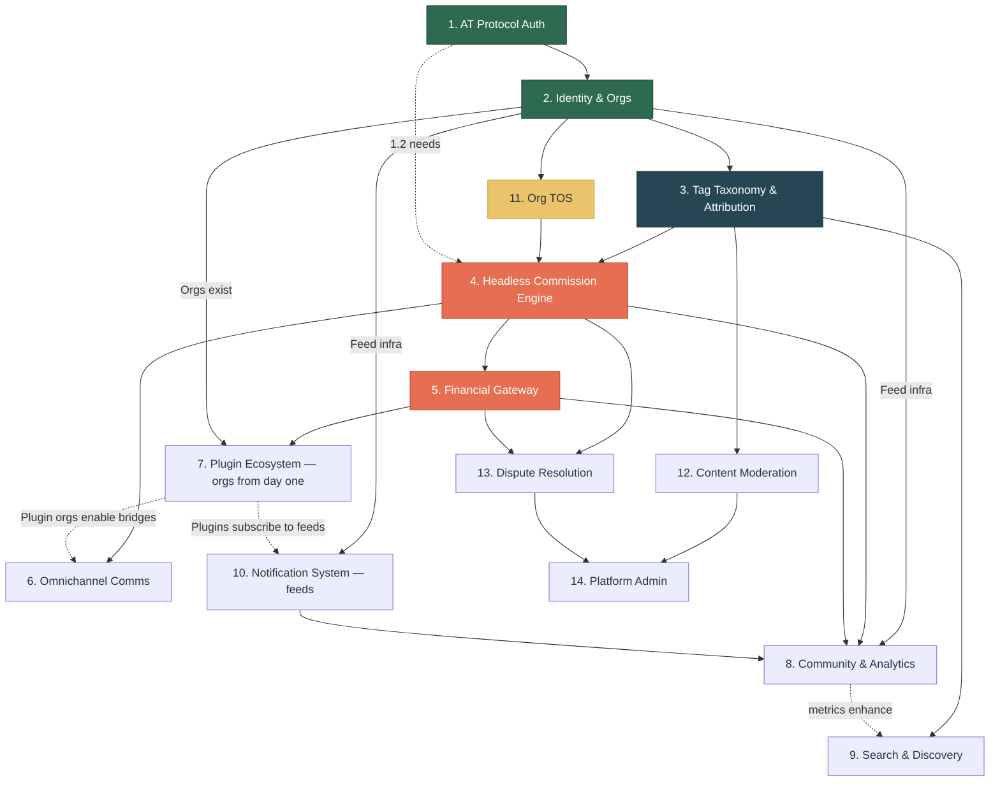

> **Revised 2026-04-12** — Tag taxonomy extracted from Feature 8 to Feature 3. All features renumbered.

# Zurfur — Feature Dependency Map

This document provides a high-level view of all 14 features, their dependencies, and a recommended implementation order.

## Architectural Foundations

Five root aggregates underpin the platform: **User**, **Organization**, **Feed**, **Commission**, **Tag**.

Key architectural decisions reflected in this plan:
- **Org-centric identity:** User is atomic. All roles/capabilities via org membership. Every user gets a personal org. Artist is an org role.
- **Feeds as universal content container:** Any entity can have feeds via `entity_feeds`. Gallery, activity = feed views (the gallery feed serves as the portfolio). Following = feed subscription.
- **Tags over columns:** Descriptive attributes are tags. The tag system is Tier 1 foundational infrastructure.
- **Headless commissions:** Internal state only. Boards are projections. Commission card is a shell with add-on slots.
- **Plugins are orgs:** Subscribe/react/post to feeds. No separate plugin API.
- **Two-tier data:** AT Protocol PDS for public, PostgreSQL for private.

## Feature Index

| # | Feature | Status | Priority |
|---|---------|--------|----------|
| 1 | [AT Protocol Auth & Bluesky Integration](01-atproto-auth/README.md) | 1.1 Done | Critical |
| 2 | [Identity & Profile Engine](02-identity-profile/README.md) | Phase 2 Done | Critical |
| 3 | [Tag Taxonomy & Attribution](03-tag-taxonomy/README.md) | Not started | Critical |
| 4 | [The Headless Commission Engine](04-commission-engine/README.md) | Not started | Critical |
| 5 | [Financial & Payment Gateway](05-financial-gateway/README.md) | Not started | Critical |
| 6 | [Omnichannel Communications](06-omnichannel-comms/README.md) | Not started | High |
| 7 | [The Plugin Ecosystem](07-plugin-ecosystem/README.md) | Not started | High |
| 8 | [Community & Analytics](08-community-analytics/README.md) | Not started | Medium |
| 9 | [Search & Discovery](09-search-discovery/README.md) | Not started | Critical |
| 10 | [Notification System](10-notification-system/README.md) | Not started | High |
| 11 | [Organization TOS Management](11-artist-tos/README.md) | Not started | High |
| 12 | [Content Moderation & Trust/Safety](12-content-moderation/README.md) | Not started | High |
| 13 | [Dispute Resolution](13-dispute-resolution/README.md) | Not started | Medium |
| 14 | [Platform Administration](14-platform-admin/README.md) | Not started | High |

## Dependency Graph



**Legend:** Green = done/in-progress, Dark blue = foundational infrastructure, Red = critical path, Yellow = next up, Dashed = soft dependency

> **Note:** All features require authentication (Feature 1.1) transitively through Feature 2. Direct edges from F1 are only shown to F2 to keep the graph clean.

## Recommended Implementation Order

### Tier 1 — Foundation (Infrastructure + MVP Critical Path)
Tags and Feeds are foundational infrastructure — other features depend on them. These must work end-to-end for the platform to function.

1. **Feature 1.1** — AT Protocol OAuth (**DONE**)
2. **Feature 2 Phase 1-2** — Identity & Org Engine (users, personal orgs, org membership, feeds, onboarding) (**DONE**)
3. **Feature 3** — Tag Taxonomy & Attribution (Tier 1 infrastructure — tags underpin search, moderation, content classification, attribution)
4. **Feature 2 Phase 3** — Characters, profile customization (depends on tag infrastructure)
5. **Feature 11** — Org TOS (required before commissions can be accepted; published to PDS)
6. **Feature 4** — Headless Commission Engine (card shell + add-on slots)
7. **Feature 5** — Financial Gateway (commissions need payments)
8. **Feature 10** — Notification System (commission updates need delivery; built on feed infrastructure)

### Tier 2 — Core Experience
Features that make the platform usable and competitive.

9. **Feature 6** — Omnichannel Communications (card chat)
10. **Feature 9** — Search, Recommendations, "Open Now" feed view
11. **Feature 12** — Content Moderation (required before public launch; uses tag system for NSFW detection)
12. **Feature 7** — Plugin Ecosystem (plugins are orgs from day one — the org and feed infrastructure already supports them; this tier adds discovery and governance)
13. **Feature 1.2-1.4** — Bluesky sync, social graph, native integration

### Tier 3 — Growth & Trust
Features that build trust and drive engagement.

14. **Feature 8** — Community & Analytics (feed subscriptions, XP for users + orgs, org metrics on PDS)
15. **Feature 13** — Dispute Resolution (user vs org, add-on slots on commission cards)
16. **Feature 14** — Platform Administration (user + org suspensions, plugin org moderation, PDS admin ops)

## The Critical Route

The absolute minimum path from "user signs up" to "artist gets paid":

```
Auth (1) → Org (2) → Tags (3) → Feeds (2+) → TOS (11) → Commission Card (4) → Invoice (5.2) → Payment (5.1) → Payout (5.1)
```

Every feature on this path is a hard blocker. Nothing downstream works until the upstream feature is complete.

## Root Aggregates

The five root aggregates and where they are introduced:

| Aggregate | Introduced In | Notes |
|-----------|--------------|-------|
| **User** | Feature 1 (Auth) | Atomic identity. All capabilities via org membership. |
| **Organization** | Feature 2 (Identity) | Every user gets a personal org. Artist = org role. Plugin = org. |
| **Tag** | Feature 3 (Tags) | Tier 1 infrastructure. Typed tags for attribution and metadata. |
| **Feed** | Feature 2+ (Feed infra) | Universal content container via `entity_feeds`. Cross-cutting. |
| **Commission** | Feature 4 (Engine) | Headless card shell with add-on slots. Internal state only. |
