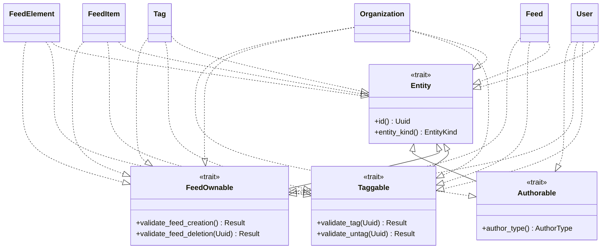

# Entity Interfaces — Design Document

> **Created 2026-04-15**

## Context

Zurfur follows "everything is an entity" — the same philosophy as Linux's "everything is a file." Every first-class domain object is identified by a UUID and connects to others through polymorphic junctions. The composability comes from uniform interfaces.

Entity interfaces are **Rust traits** in the `domain` crate. All entities implement all capability traits by default. Unused capabilities cost nothing — new features emerge from new combinations of existing primitives.

**This work must be completed BEFORE OpenAPI documentation** so we don't define API schemas twice.

### Codebase State

The project is a layered DDD Rust backend:
```
backend/crates/
  domain/        # Pure entities, repository traits, errors (no I/O)
  shared/        # JWT utilities, config structs
  persistence/   # SQLx PostgreSQL implementations
  application/   # Use-case orchestrators (services)
  api/           # Axum HTTP handlers, middleware, routing
```

The domain crate currently has **no shared Entity trait**. Each entity is an independent struct with its own `id: Uuid` field. Two separate entity type enums exist (`EntityType`, `TaggableEntityType`) with different variant sets — these will be **unified into a single `EntityKind` enum**.

### Current Entity Structs

| Entity | File | Has `id: Uuid` | Notes |
|--------|------|-----------------|-------|
| `User` | `domain/src/user.rs` | Yes | Atomic auth identity. No `created_at`/`updated_at`. |
| `Organization` | `domain/src/organization.rs` | Yes | Public identity container. Has `slug`, `display_name`, `is_personal`. |
| `Feed` | `domain/src/feed.rs` | Yes | Universal content container. Has `slug`, `feed_type`, soft delete. |
| `Tag` | `domain/src/tag.rs` | Yes | Typed taxonomy. Has `category` (PG ENUM), `usage_count`, `is_approved`. |
| `FeedItem` | `domain/src/feed_item.rs` | Yes | Immutable post. Has `feed_id`, `author_type`, `author_id`. No `updated_at`. |
| `FeedElement` | `domain/src/feed_element.rs` | Yes | Content block. Has `feed_item_id`, `element_type`, `content_json`, `position`. |
| `Character` | Not yet implemented | — | Planned (Phase 2.3). Design at `design/features/02-identity-profile/PHASE3_DESIGN.md`. |
| `Commission` | Not yet implemented | — | Planned (Feature 4). |

### Current Entity Type Enums (to be replaced)

**`EntityType`** in `domain/src/entity_feed.rs:13-18` — feed ownership:
- Variants: `Org`, `Character`, `Commission`, `User`
- String values: `"org"`, `"character"`, `"commission"`, `"user"`
- DB CHECK: `entity_type IN ('org', 'character', 'commission', 'user')` (migration `20260409000001`)

**`TaggableEntityType`** in `domain/src/entity_tag.rs:18-24` — tag attachment:
- Variants: `Org`, `Commission`, `FeedItem`, `Character`, `FeedElement`
- String values: `"org"`, `"commission"`, `"feed_item"`, `"character"`, `"feed_element"`
- DB CHECK: `entity_type IN ('org', 'commission', 'feed_item', 'character', 'feed_element')` (migration `20260412000001`)

**`AuthorType`** in `domain/src/feed_item.rs:21-25` — feed item authorship (stays separate):
- Variants: `User`, `Org`, `System`
- String values: `"user"`, `"org"`, `"system"`

### Domain Module Registry

`domain/src/lib.rs` currently exports 16 modules. The new `entity` module will be added here.

---

## Unified EntityKind Enum

Since all entities implement all capabilities, `EntityType` and `TaggableEntityType` have identical variant sets after expansion. They are **unified into a single `EntityKind` enum**.

```rust
/// The kind of entity. Used as the discriminator in all polymorphic junction
/// tables (entity_feed, entity_tag). Every domain struct maps to exactly one
/// EntityKind variant.
#[derive(Debug, Clone, Copy, PartialEq, Eq)]
pub enum EntityKind {
    User,
    Org,
    Character,
    Commission,
    Feed,
    Tag,
    FeedItem,
    FeedElement,
}
```

With `as_str()` / `from_str()` / `From` / `TryFrom` implementations following the existing pattern.

String mappings: `"user"`, `"org"`, `"character"`, `"commission"`, `"feed"`, `"tag"`, `"feed_item"`, `"feed_element"`.

### What happens to EntityType and TaggableEntityType?

They are **removed**. All code that references them switches to `EntityKind`:
- `entity_feed.rs`: `EntityType` → `EntityKind`. `EntityFeed.entity_type` field type changes.
- `entity_tag.rs`: `TaggableEntityType` → `EntityKind`. `EntityTag.entity_type` field type changes.
- `entity_feed_repository.rs` (persistence): method signatures update.
- `entity_tag_repository.rs` (persistence): method signatures update.
- `feed.rs`: `FeedRepository` trait methods that take `EntityType` update to `EntityKind`.
- `tag.rs`: `TagRepository` trait methods that take `TaggableEntityType` update to `EntityKind`.
- `application/src/feed/service.rs`: all `EntityType` references → `EntityKind`.
- `application/src/tag/service.rs`: all `TaggableEntityType` references → `EntityKind`.
- `api/src/routes/feeds.rs`: all `EntityType` references → `EntityKind`.
- `api/src/routes/tags.rs`: all `TaggableEntityType` references → `EntityKind`.
- `api/src/routes/organizations.rs`: tag creation calls update.
- Test mocks in `api/src/tests/`: update mock signatures.

### AuthorType stays separate

`AuthorType` remains its own enum because it is a genuinely different set — `System` is a virtual author, not an entity. Only actors implement `Authorable`.

---

## Trait Hierarchy



---

## Trait Definitions

### Entity (base)

Every domain object implements this. Provides identity and kind discrimination.

```rust
pub trait Entity: Send + Sync {
    /// The entity's UUID primary key.
    fn id(&self) -> Uuid;

    /// The kind of entity. Used as the discriminator in polymorphic
    /// junction tables (entity_feed, entity_tag).
    fn entity_kind(&self) -> EntityKind;
}
```

### Taggable

Can have tags attached via `entity_tag`. **All entities implement this.** Provides validation hooks that the domain uses to enforce business rules before persistence. Entities that don't care about tag validation use the default `Ok(())`.

```rust
pub trait Taggable: Entity {
    /// Domain validation before a tag is attached.
    /// Override to enforce entity-specific rules (e.g., cycle detection for tags tagging tags).
    /// Default: allow all.
    fn validate_tag(&self, tag_id: Uuid) -> Result<(), String> {
        Ok(())
    }

    /// Domain validation before a tag is detached.
    /// Override to prevent removal of required tags (e.g., identity tags).
    /// Default: allow all.
    fn validate_untag(&self, tag_id: Uuid) -> Result<(), String> {
        Ok(())
    }
}
```

Services use trait bounds — the service does persistence, the trait enforces domain rules:

```rust
// application layer
impl TagService {
    pub async fn tag(&self, entity: &impl Taggable, tag_id: Uuid) -> Result<...> {
        entity.validate_tag(tag_id)?;              // domain rules
        self.repo.attach(entity.entity_kind(),     // persistence
            entity.id(), tag_id).await
    }
}
```

### FeedOwnable

Can own feeds via `entity_feed`. **All entities implement this.** Same validation hook pattern as Taggable.

For most entities, this means concrete feeds in the `feeds` table. For Tags, this will be a **virtualized query** — the trait exists but the implementation queries `entity_tag` to find tagged content rather than looking up a feed row. This virtualized implementation is deferred (post-MVP).

```rust
pub trait FeedOwnable: Entity {
    /// Domain validation before a feed is created for this entity.
    /// Override to enforce entity-specific rules.
    /// Default: allow all.
    fn validate_feed_creation(&self) -> Result<(), String> {
        Ok(())
    }

    /// Domain validation before a feed is detached/deleted from this entity.
    /// Override to prevent deletion of required feeds (e.g., system feeds).
    /// Default: allow all.
    fn validate_feed_deletion(&self, feed_id: Uuid) -> Result<(), String> {
        Ok(())
    }
}
```

### Authorable

Can author feed items. **Selective — only actors.**

Characters belong to an organization and can be seen as specialized feeds given significance by the users that see them. They are posted ON, not BY — authorship traces back to the parent org.

```rust
pub trait Authorable: Entity {
    fn author_type(&self) -> AuthorType;
}
```

Implementors: `User` (`AuthorType::User`), `Organization` (`AuthorType::Org`). `System` is a virtual author (not a struct).

---

## Migration

Single migration to update both CHECK constraints to accept the unified `EntityKind` values:

```sql
-- Expand entity_feed to accept all entity kinds
ALTER TABLE entity_feed DROP CONSTRAINT IF EXISTS entity_feed_entity_type_check;
ALTER TABLE entity_feed ADD CONSTRAINT entity_feed_entity_type_check
    CHECK (entity_type IN (
        'user', 'org', 'character', 'commission',
        'feed', 'tag', 'feed_item', 'feed_element'
    ));

-- Expand entity_tag to accept all entity kinds
ALTER TABLE entity_tag DROP CONSTRAINT IF EXISTS entity_tag_entity_type_check;
ALTER TABLE entity_tag ADD CONSTRAINT entity_tag_entity_type_check
    CHECK (entity_type IN (
        'user', 'org', 'character', 'commission',
        'feed', 'tag', 'feed_item', 'feed_element'
    ));
```

Note: The DB column name stays `entity_type` (no rename needed — it's just a TEXT column). The Rust type changes from `EntityType`/`TaggableEntityType` to `EntityKind`.

Find the current constraint names by checking migrations:
- `entity_feed` CHECK is in `persistence/migrations/20260409000001_add_feeds_onboarding.sql:65`
- `entity_tag` CHECK is in `persistence/migrations/20260412000001_schema_cleanup_and_tags.sql:80-81`

---

## Implementation Per Entity

### New file: `domain/src/entity.rs`

Define `EntityKind` enum and all four traits (`Entity`, `Taggable`, `FeedOwnable`, `Authorable`). Import `Uuid` and `AuthorType` from `crate::feed_item`.

`EntityKind` lives here (not in `entity_feed.rs` or `entity_tag.rs`) because it's the shared foundation.

### `domain/src/entity_feed.rs`

- **Remove** `EntityType` enum entirely (replaced by `EntityKind` from `entity.rs`)
- Update `EntityFeed` struct: `entity_type: EntityType` → `entity_type: EntityKind`
- Update `EntityFeedRepository` trait: all `EntityType` params → `EntityKind`
- Update imports throughout
- Remove the `entity_type_round_trip` test (moved to `entity.rs`)

### `domain/src/entity_tag.rs`

- **Remove** `TaggableEntityType` enum entirely (replaced by `EntityKind` from `entity.rs`)
- Update `EntityTag` struct: `entity_type: TaggableEntityType` → `entity_type: EntityKind`
- Update `EntityTagRepository` trait: all `TaggableEntityType` params → `EntityKind`
- Update imports throughout
- Remove the `taggable_entity_type_round_trip` test (moved to `entity.rs`)

### `domain/src/user.rs`

Implement `Entity`, `Taggable`, `FeedOwnable`, `Authorable`:
- `entity_kind()` → `EntityKind::User`
- `author_type()` → `AuthorType::User`

### `domain/src/organization.rs`

Implement `Entity`, `Taggable`, `FeedOwnable`, `Authorable`:
- `entity_kind()` → `EntityKind::Org`
- `author_type()` → `AuthorType::Org`

### `domain/src/feed.rs`

Implement `Entity`, `Taggable`, `FeedOwnable`:
- `entity_kind()` → `EntityKind::Feed`
- Update `FeedRepository::create_and_attach`: `entity_type: EntityType` → `entity_type: EntityKind`

### `domain/src/tag.rs`

Implement `Entity`, `Taggable`, `FeedOwnable`:
- `entity_kind()` → `EntityKind::Tag`
- Update `TagRepository` methods: all `TaggableEntityType` params → `EntityKind`

### `domain/src/feed_item.rs`

Implement `Entity`, `Taggable`, `FeedOwnable`:
- `entity_kind()` → `EntityKind::FeedItem`
- `AuthorType` stays in this file (it's specific to feed items, not a shared entity concept)

### `domain/src/feed_element.rs`

Implement `Entity`, `Taggable`, `FeedOwnable`:
- `entity_kind()` → `EntityKind::FeedElement`

### `domain/src/lib.rs`

Add `pub mod entity;` to module list.

### Persistence layer updates

All repository implementations in `persistence/src/repositories/` that reference `EntityType` or `TaggableEntityType`:
- `entity_feed_repository.rs`: `EntityType` → `EntityKind`
- `entity_tag_repository.rs`: `TaggableEntityType` → `EntityKind`
- `feed_repository.rs`: `EntityType` in `create_and_attach` → `EntityKind`
- `tag_repository.rs`: `TaggableEntityType` in action methods → `EntityKind`

### Application layer updates

- `application/src/feed/service.rs`: `EntityType` → `EntityKind`
- `application/src/tag/service.rs`: `TaggableEntityType` → `EntityKind`
- `application/src/onboarding/service.rs`: `EntityType` → `EntityKind`

### API layer updates

- `api/src/routes/feeds.rs`: `EntityType` → `EntityKind`
- `api/src/routes/tags.rs`: `TaggableEntityType` → `EntityKind`
- `api/src/routes/organizations.rs`: tag creation calls
- `api/src/tests/mock_feeds.rs`: mock signatures
- `api/src/tests/mock_tags.rs`: mock signatures

---

## Key Design Decisions

| Decision | Rationale |
|----------|-----------|
| Unified `EntityKind` enum | `EntityType` and `TaggableEntityType` had different variants because capabilities were opt-in. Now that all entities implement all capabilities, the sets are identical — one enum suffices. |
| Traits have validation hooks, not persistence methods | Domain stays pure (no I/O). Traits define `validate_tag()`, `validate_feed_creation()`, etc. with default `Ok(())`. Services do persistence, traits enforce domain rules. |
| Services use trait bounds | `tag(&self, entity: &impl Taggable, ...)` — only taggable entities can be tagged. Compile-time enforcement. Services are generic over anything that implements the trait. |
| All entities implement Taggable + FeedOwnable | "Features are combinations, not constructions." Unused capabilities cost nothing. |
| Authorable is selective (User, Org only) | Characters are posted ON, not BY. `AuthorType` stays separate because `System` is not an entity. |
| Tag feeds are virtualized queries (deferred) | Tags don't need a feed table row. Their "feed" is computed by querying entity_tag. Trait exists now, implementation later. |
| FeedOwnable does NOT imply auto-created feeds | Feed creation is entity-specific action logic, not an interface contract. |
| Event structure is string convention | `event.feed.TYPE.SUBTYPE` — decentralized, anyone can emit. Matches AT Protocol lexicon style. |
| Subscribable is NOT a trait | It's a consequence of FeedOwnable. You subscribe to feeds, not entities. |
| DB column stays `entity_type` | No column rename. The Rust type changes; the DB column is just TEXT. |

## Impact on Phase 2.3 (Characters)

The entity interfaces design changes the Character implementation:

**Character gallery is a filtered view of the Org's feed**, not a separate feed per character. Content is posted to the org's feed and tagged with the character. The character's "gallery" is a query: org feed items tagged with character X. This is simpler and follows the domain rule that entities are atomic and feeds belong to orgs.

The Phase 3 plan's `create_with_feed` action method is no longer needed for characters. Instead, characters get tagged when content is posted to the org's feed. See `design/features/02-identity-profile/PHASE3_DESIGN.md` for the original plan (will be updated after this work lands).

## Deferred

- Character and Commission structs (trait impls added when those entities are built)
- Virtualized query implementation for Tag feeds (trait exists, implementation comes with topic following)
- `is_locked` flag on identity tags for platform admin control
- Inherited feed permissions through entity relationships (see ROADMAP.md)

## Test Plan

### Unit Tests (domain crate)

| Test | What it verifies |
|------|-----------------|
| `entity_kind_round_trip` | All 8 `EntityKind` variants survive `as_str()` → `from_str()` |
| `entity_kind_from_str_unknown` | Unknown strings return `None` |
| `user_implements_entity` | `User` returns `EntityKind::User` from `entity_kind()` |
| `org_implements_entity` | `Organization` returns `EntityKind::Org` |
| `feed_implements_entity` | `Feed` returns `EntityKind::Feed` |
| `tag_implements_entity` | `Tag` returns `EntityKind::Tag` |
| `feed_item_implements_entity` | `FeedItem` returns `EntityKind::FeedItem` |
| `feed_element_implements_entity` | `FeedElement` returns `EntityKind::FeedElement` |
| `user_is_authorable` | `User` returns `AuthorType::User` from `author_type()` |
| `org_is_authorable` | `Organization` returns `AuthorType::Org` |
| `taggable_validate_default_allows` | Default `validate_tag()` returns `Ok(())` |
| `taggable_validate_untag_default_allows` | Default `validate_untag()` returns `Ok(())` |
| `feed_ownable_validate_default_allows` | Default `validate_feed_creation()` returns `Ok(())` |
| `trait_bounds_compile` | Compile-time check: functions accepting `impl Taggable`, `impl FeedOwnable`, `impl Authorable` accept the correct entity types |

### Unit Tests (application crate)

| Test | What it verifies |
|------|-----------------|
| `tag_service_uses_entity_kind` | `TagService` calls repo with correct `EntityKind` discriminator when tagging |
| `feed_service_uses_entity_kind` | `FeedService` calls repo with correct `EntityKind` when creating/attaching feeds |
| `tag_service_calls_validate_tag` | Service calls `validate_tag()` before persisting — mock entity that returns `Err` should prevent tagging |
| `feed_service_calls_validate_feed` | Service calls `validate_feed_creation()` before persisting |
| `existing_org_tag_tests_pass` | All existing tag tests still pass with `EntityKind` replacing `TaggableEntityType` |
| `existing_feed_tests_pass` | All existing feed tests still pass with `EntityKind` replacing `EntityType` |

### Integration Tests (persistence crate, `sqlx::test`)

| Test | What it verifies |
|------|-----------------|
| `entity_feed_accepts_all_kinds` | All 8 `EntityKind` values pass the CHECK constraint on `entity_feed` |
| `entity_tag_accepts_all_kinds` | All 8 `EntityKind` values pass the CHECK constraint on `entity_tag` |
| `entity_feed_rejects_unknown` | Invalid `entity_type` string rejected by CHECK constraint |
| `entity_tag_rejects_unknown` | Invalid `entity_type` string rejected by CHECK constraint |
| `tag_attach_with_entity_kind` | Full attach flow: create tag, attach to entity with `EntityKind`, verify `entity_tag` row |
| `feed_attach_with_entity_kind` | Full attach flow: create feed, attach with `EntityKind`, verify `entity_feed` row |
| `tag_action_method_transaction` | `create_and_attach` atomicity: tag + attachment + usage_count in one transaction |
| `feed_action_method_transaction` | `create_and_attach` atomicity: feed + entity_feed in one transaction |
| `migration_idempotent` | Migration runs cleanly on a fresh DB and on a DB with existing data |

### E2E Tests (API crate)

| Test | What it verifies |
|------|-----------------|
| `create_org_tag_e2e` | `POST /tags` + `POST /tags/attach` with org entity → tag appears on `GET /tags/entity/org/:id` |
| `create_feed_for_entity_e2e` | `POST /orgs/:id/feeds` → feed appears on `GET /orgs/:id/feeds` (via entity_feed lookup) |
| `tag_attach_with_new_entity_kinds` | Attach tags to User, Feed, Tag entities via API → verify 200 response and correct storage |
| `feed_attach_with_new_entity_kinds` | Create feeds for Tag, Feed entities via API → verify correct entity_feed junction |
| `existing_api_tests_unchanged` | All existing API tests (auth, org, feed, tag, onboarding) pass without modification |

---

## Integration Testing

The codebase is large enough to warrant integration tests that hit a real PostgreSQL database. Use `sqlx::test` — it creates a fresh test database per test, runs migrations automatically, and drops the database after.

### Why `sqlx::test`

- Real PostgreSQL, real queries — catches SQL bugs that mock repos miss
- Per-test isolation — each test gets its own database
- Migrations run automatically — tests always match the current schema
- Couples to SQLx, but changing the database engine is a large change regardless

### Setup

Add `sqlx` dev-dependency to the `persistence` crate (it's already a regular dependency). Tests go in `persistence/tests/` as integration tests.

```rust
// persistence/tests/entity_tag_integration.rs
use sqlx::PgPool;

#[sqlx::test(migrations = "migrations")]
async fn tag_attach_and_detach(pool: PgPool) {
    let repo = SqlxEntityTagRepository::new(pool.clone());
    // ... test with real DB
}
```

### What to test

Integration tests focus on things mocks can't catch:
- CHECK constraints (does the DB accept the new `EntityKind` values?)
- Foreign key cascading behavior
- Transaction atomicity (action methods)
- Unique constraint violations
- Query correctness (joins, filters, pagination)

Unit tests (existing mock-based tests in `api/src/tests/`) stay for testing service logic, permission checks, and API response shapes.

### Test structure

```
persistence/
  tests/
    common/mod.rs          # Shared test helpers (create test user, org, etc.)
    entity_kind_tests.rs   # Verify all EntityKind values accepted by CHECK constraints
    tag_integration.rs     # Tag attach/detach/action methods
    feed_integration.rs    # Feed create/attach/action methods
```

### Required env

`sqlx::test` needs `DATABASE_URL` pointing to a PostgreSQL instance (the existing Docker Compose one works). It creates/drops temporary test databases automatically — no manual setup needed.

## Verification

```bash
cargo test --workspace          # All tests pass (unit + integration)
cargo build --workspace         # No warnings
```

After implementation, verify:
1. `EntityKind` has 8 variants with round-trip `as_str()`/`from_str()` tests
2. `EntityType` and `TaggableEntityType` are fully removed — no references remain
3. All entity structs implement `Entity + Taggable + FeedOwnable`
4. `User` and `Organization` additionally implement `Authorable`
5. Migration runs cleanly on existing database
6. All existing unit tests pass (the change is functionally equivalent — same strings in the DB)
7. `AuthorType` is unchanged
8. Integration tests pass: all `EntityKind` values accepted by both CHECK constraints
9. Integration tests pass: tag and feed action methods work with the new enum
